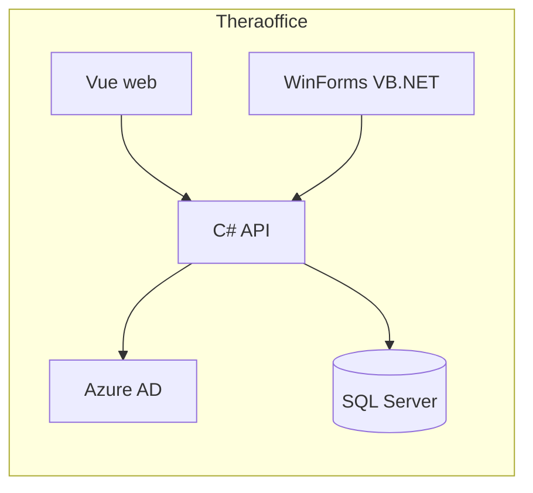
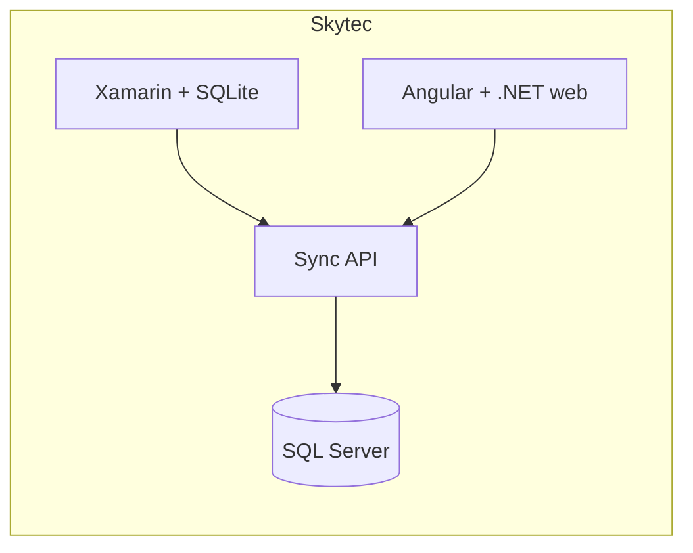
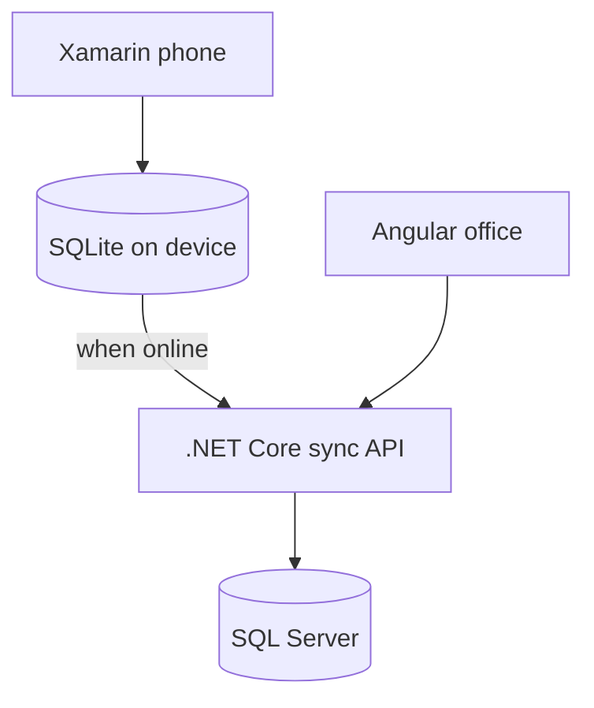
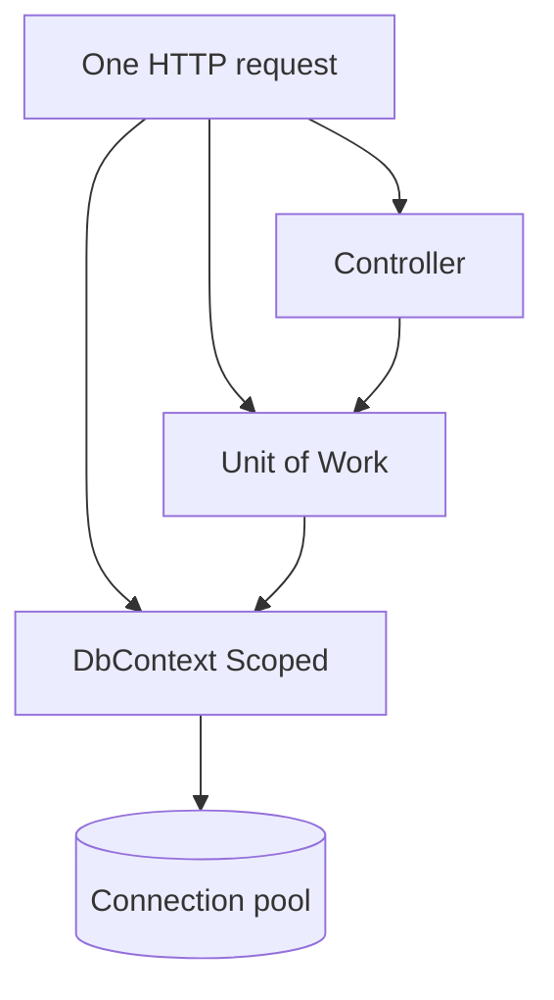
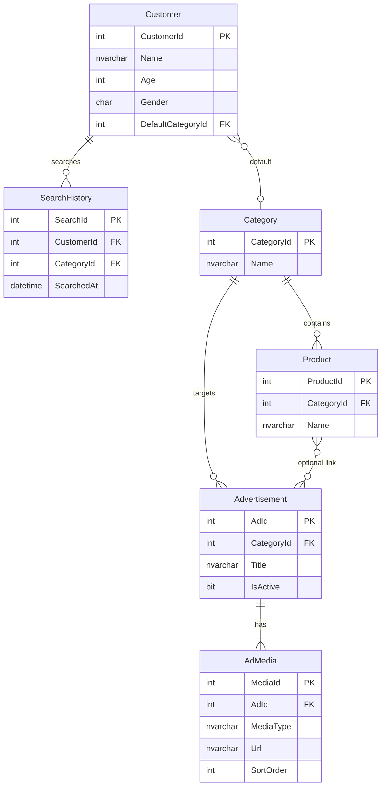
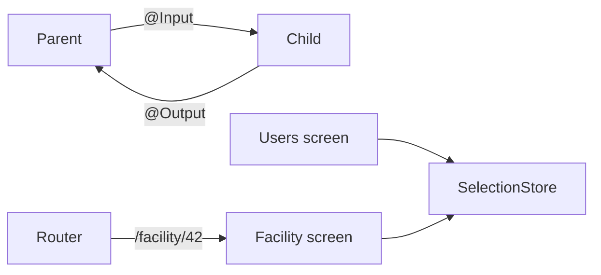

# Sangeetha interview — what you said vs the right answer

Source: `Sangeetha-Interview.mp3` (~46 minutes). Whisper transcript is `Sangeetha-Interview.txt`. Stack they asked: .NET + EF + SQL + Angular + a little AI.

Open `Sangeetha-Interview.html` → **Print / Save PDF**. Rebuild: `python ClientInterview/build_sangeetha_interview.py`

Grey box = what you said (cleaned from the recording). Peach box = what to say next time. Full sentences.

Do not say “in this session” or “in this video”. You are answering an interview, not taking a class.

---

## How the interview went

**Mark: 5 / 10.** From their tone, this is **not a strong pass**. Plan as if you must do the next round better. HR still decides. We cannot know the letter they send.

They were **polite**. They gave hints. They did not shout. That is not the same as “we want you”.

Notice these lines from the recording:

1. On design: they said this was **correcting a bug**, not a design. Then they dropped that question.
2. On `DbContext`: they kept asking why Transient. You changed to Scoped only after they pushed.
3. On the SQL board: they gave hints (“there must be a link between product and advertisement”). Then: **we have other topics, we will move on**. They stopped waiting for a full answer.
4. On download: **so far you have never included an Observable**. That is a tired line, not a happy line.
5. At the end: feedback to HR. **All the best for your career.** That is a close. It is not “let us schedule the next round on this call”.

| Piece | Mark | Why |
|---|---|---|
| Intro | 6 | Two products. Vue and VB.NET got mixed. Sky trac missing. |
| Design you did | 3 | WCF DLL fix. They wanted a picture you designed. |
| EF + migration | 7 | Code first, `Up` / `Down`. Good enough. |
| Middleware | 5 | Auth, log, cache. You did not say **filter** for a few actions. |
| DbContext lifetime | 4 | Transient first. Scoped only at the end. |
| SQL tables + query | 3 | See your five tables below. Query does not return **one ad for this user**. |
| Deadlock | 4 | Same lock order is right. “DBA deadlock command” is not. |
| Angular share data | 6 | `@Input` `@Output` RxJS router. Fine. |
| Multi download | 4 | S3 and `async` first. `forkJoin` very late. |
| Angular version | 5 | 14, then 16. |
| AI POC | 7 | Copilot, Opus, Document Intelligence, copy model. This part was fine. |

**Overall 5.** For eight years they expect Scoped, one clean JOIN, deadlock 1205, and Observable in the first sentence. Those four were slow or wrong. The AI and EF parts saved the score from going lower.

What to do now: own the SQL board and Scoped until you can draw them with the sound off. That is how the next interview goes to 7.

---

## How to use this printout

1. **What you said** — read it once. Notice the gap. Do not memorise the gap.
2. **Say** — speak the peach box. About twenty seconds.
3. **Walk through** — if they stay on the question. **First, why** → example → **Before vs After** → Notice that → This means → **How they call it**.
4. Point at the **diagram**. Put **your** module names on the boxes.

When you speak: **what it is → where you used it → why → how → what problem it solved**.

Whisper heard “Sankita”, “view”, “.NET Co”. Those are **Sangeetha**, **Vue**, **.NET Core**. The grey boxes use the cleaned words.

---

## 1. Opening

### Q. Tell me about yourself / technical expertise

#### What you said

> I have around eight plus years as a .NET developer. I have worked on .NET Core, MVC, SQL, VB.NET, Vue with TypeScript, Angular, and Azure for deploy.
>
> Current project is **Theraoffice**. Therapy monitoring. Front end is Vue with TypeScript. There is also a Windows application. For the web we used VB.NET. I migrated APIs from .NET Framework to .NET Core. Database is SQL.
>
> The other project is **Skytec**. Inspection. Mobile is Xamarin. Web is .NET and Angular. A .NET Core API syncs mobile and web. Phone database is SQLite.

#### Right answer

> **Say:** I am a hands-on full-stack engineer. About eight years. I work on **Theraoffice**, **Skytec**, and **Sky trac**.
>
> **Theraoffice** is a clinic product. Vue on the web. A legacy WinForms VB.NET desktop. Both talk to a C# API. Auth is Azure AD. Database is SQL Server. I migrated APIs from .NET Framework to .NET Core.
>
> **Skytec** is inspection. Xamarin on the phone with SQLite. Angular and .NET on the web. A .NET Core API syncs the two.
>
> **Sky trac** is microservices. Angular and mobile go through WAF, then an API Gateway, then Order, Payment, and Product. Auth is Azure AD.

#### Walk through

First, why is she asking this? She wants **your** products, and she wants **what you touched**. She does not want a list of every Microsoft word.

1. One line: role and years. Stop.
2. Name the three products. One breath each. UI, API, database, auth.
3. Then your pieces. Example: “On Skytec I owned the sync API. On Theraoffice I owned the Vue screens that call the C# API.”
4. One production fix. This shows you are hands-on.

Notice that in the recording you mixed Theraoffice. Vue is the **web**. VB.NET is the **desktop**. They both call a C# API. Do not say “the web application is VB.NET”.

You also stopped after two products. Add **Sky trac** in one breath. Then stop.





#### Fix for next time

- Practise the three products out loud. Twenty seconds. Then stop.
- One line on **what you owned**. Not the whole company stack.

---

### Q. Design work you did — why was that design created?

#### What you said

> If a new API has to be designed, I will check the database tables. If I need a new table, I will check that.
>
> Recently, on migration, the payment API had an issue. Previously it was WCF. An error came. I did a small POC and found it was a DLL issue.

They then said this was **correcting an issue**, not a design. They moved to straight technical questions.

#### Right answer

> **Say:** They want a **component I designed**, not a bug I fixed.
>
> On **Skytec**, inspectors work on site. The network is weak. So the phone must work offline. I designed it this way: Xamarin stores rows in **SQLite** on the device. When the network is back, a .NET Core **sync API** sends the inspection to SQL Server. The office Angular app reads the same SQL.
>
> Why this design? If the phone waited for the API on every save, the inspector could not finish the job in the field.
>
> On **Sky trac**, mobile and Angular do not call Order and Payment directly. They hit a **WAF**, then an **API Gateway**. The gateway does authorization, rate limit, load balance, and cache. Then Order, Payment, Product.

#### Walk through

First, why this question? They want: **problem → your design → why that shape**. A DLL fix is useful later. It is not this answer.

Let us understand this with an example. Skytec.

1. **Problem.** Inspector is on a site. Signal drops.
2. **Design.** Local SQLite. Sync API when online.
3. **Why.** The job must finish even when the API is down.
4. **What you owned.** The sync endpoints, or the SQLite schema, or both. Say which.

Notice that “I check the tables” is a **habit**. It is not a design. A design has a picture.



#### Fix for next time

- Keep one picture ready. Skytec offline sync **or** Sky trac gateway.
- If they say “from your side”, name **your** module. Not “we used WCF”.

---

## 2. Entity Framework and a new microservice

### Q. New microservice from scratch — how do you use Entity Framework?

#### What you said

> I will use the code first approach. The database is not there. We create entities and we apply the migration.

#### Right answer

> **Say:** For a **new** service, I use **code first**. I write the C# entity. I add a migration. EF creates the database.
>
> If the database **already** exists, and we must not break it, I use **database first**. I scaffold from SQL. I do not let EF drop production tables.

#### Walk through

First, why two approaches? Because “from scratch” means there is **no** database yet.

1. **Code first** — C# is the source. EF writes SQL.
2. **Database first** — SQL is the source. EF writes C#.
3. **This question** is from scratch. So code first.

```csharp
public class Customer
{
    public int CustomerId { get; set; }
    public string Name { get; set; } = "";
}

public class AppDbContext : DbContext
{
    public AppDbContext(DbContextOptions<AppDbContext> options)
        : base(options) { }

    public DbSet<Customer> Customers => Set<Customer>();
}
```

```csharp
builder.Services.AddDbContext<AppDbContext>(o =>
    o.UseSqlServer(builder.Configuration.GetConnectionString("App")));
```

Notice that you said “support first” first, then “code first”. Say **code first** in the first sentence.

---

### Q. How do you apply a migration? Schema change — add a column

#### What you said

> We create a script. `dotnet ef` add migration, then DB update.
>
> There is a customer table. We need an address column. I add a string property with get set. Save. Add migration. Then update. It will run the migration.
>
> If it is a new field we can go for this. The migration creates a snapshot and the migration file. There is `Up` and `Down`. `Up` has the new changes. `Down` undoes them.

#### Right answer

> **Say:** I change the C# entity. Then I add a migration. Then I update the database. For production I do **not** run `database update` from my laptop. I generate a **SQL script** and DBA runs it.
>
> `Up` applies the change. `Down` rolls it back. The snapshot is EF’s picture of the model **after** this migration.

#### Walk through

Let us understand this with an example. Customer needs `Address`.

**1. Change the entity**

```csharp
public class Customer
{
    public int CustomerId { get; set; }
    public string Name { get; set; } = "";
    public string? Address { get; set; }
}
```

**2. Add the migration, then either update or script**

```text
dotnet ef migrations add AddCustomerAddress
dotnet ef database update
```

For production:

```text
dotnet ef migrations script --idempotent -o AddCustomerAddress.sql
```

`--idempotent` means the script checks `__EFMigrationsHistory`. It will not run the same migration twice.

**3. What EF wrote** — this is the “script” they asked for.

```csharp
public partial class AddCustomerAddress : Migration
{
    protected override void Up(MigrationBuilder b)
    {
        b.AddColumn<string>(
            name: "Address",
            table: "Customers",
            type: "nvarchar(max)",
            nullable: true);
    }

    protected override void Down(MigrationBuilder b)
    {
        b.DropColumn(name: "Address", table: "Customers");
    }
}
```

Notice that `database update` is fine on your machine. On production, give DBA the `.sql` file.

This means: you were close. Name the **commands**. Name **Up / Down / snapshot**. Name the **script** for production.

---

## 3. Middleware and DI lifetime

### Q. Custom middleware — what logic? Can it run for a few actions only?

#### What you said

> Authorization. Logging. Caching. Login.
>
> Why custom? All API requests go via the middleware.
>
> Custom middleware can run for a few actions instead of the entire application.
>
> How? For caching we can use frequently used values.

They asked: is that even possible? How would you do that? You did not say **filter**.

#### Right answer

> **Say:** Middleware is a pipe around HTTP. `next()` goes in. The rest of the pipe runs. Then the code after `next()` sees the response.
>
> I put **cross-cutting** work here: correlation id, session id, request logging. Not “login business rules”.
>
> For **a few actions only**, I do not put that check on the global pipe. I use an **action filter**. Middleware is for every request. A filter is for one action or one controller.

#### Walk through

Let us understand middleware. The request goes through a list of steps, then comes **back** out the same list.

1. Exception handler, CORS, HTTPS.
2. `UseAuthentication` reads the JWT if it is there.
3. Custom middleware can check a **session id** on every call.
4. Then the controller action runs.

**1. The middleware class**

```csharp
public class SessionIdMiddleware
{
    private readonly RequestDelegate _next;
    public SessionIdMiddleware(RequestDelegate next)
    {
        _next = next;
    }

    public async Task InvokeAsync(HttpContext ctx)
    {
        var path = ctx.Request.Path;
        if (path.StartsWithSegments("/health") ||
            path.StartsWithSegments("/login"))
        {
            await _next(ctx);
            return;
        }

        var sessionId = ctx.Request.Headers["X-Session-Id"]
            .ToString();
        if (string.IsNullOrWhiteSpace(sessionId))
        {
            ctx.Response.StatusCode = 401;
            await ctx.Response.WriteAsync(
                "Session id is missing.");
            return;
        }

        await _next(ctx);
    }
}
```

**2. How we add it**

```csharp
app.UseAuthentication();
app.UseMiddleware<SessionIdMiddleware>();
app.UseAuthorization();
app.MapControllers();
```

Notice that if session id is missing, we **do not** call `next()`. The controller never runs.

Now their extra question: **only some actions**.

If you `app.Use` “must be admin” on the whole app, health and login break. Admin create-user is **one method**. That is a **filter**.

| | Middleware | Filter |
|---|---|---|
| Where | HTTP pipe, before MVC | After routing picked the action |
| Knows the action name? | No, unless you look it up | Yes |
| Use when | Almost every request | One action or controller |
| Example | Session id | `[Authorize(Policy = "Admin")]` |

<div class="mc-row" markdown="1">
<div class="mc-col mc-alt" markdown="1">
<span class="mc-lbl">Middleware — almost every request</span>

```csharp
app.UseMiddleware<SessionIdMiddleware>();
```

</div>
<div class="mc-col mc-alt" markdown="1">
<span class="mc-lbl">Filter — one action only</span>

```csharp
[AdminOnly]
[HttpPost]
public IActionResult CreateUser(UserDto dto)
{
    return Ok();
}
```

</div>
</div>

#### Fix for next time

- List three: logging, correlation id, session id. Stop.
- When they say “few actions”, say **filter**. That one word was the answer.

---

### Q. DbContext / SQL connection lifetime — Scoped or Transient?

#### What you said

> There are three types of DI. I would use **Transient**. It closes the connection immediately. Rather than Scoped, we can use Transient.
>
> Advantage? It is not a good thing if the connection stays open. With 500 users, 500 connections hurt the database. Transient closes the connection automatically.
>
> (After they pushed.) No. We can use **Scoped**. One API call, business layer and data layer reuse the same database object.

#### Right answer

> **Say:** `DbContext` is **Scoped**. One object per HTTP request. Controller, repository, and activity log all share it. When the request ends, that context is disposed. The connection goes back to the pool.
>
> I do not register `DbContext` as Transient. Each inject would get a **new** context. You save the order on one context and the lines on another. The unit of work breaks.
>
> I do not register it as Singleton. Two users would share one tracker.

#### Walk through

First, why does lifetime matter? EF tracks entities. The connection comes from the **pool**. Dispose does not “kill SQL Server”. It returns the connection.

They asked about 500 users. Notice that **Scoped** is still one context **per request**, not 500 forever. User 1’s request ends. That context is gone. User 2 gets a new one.

**Transient** inside one request: business layer asks for `DbContext` — new. Data layer asks again — **another** new. Two connections. Two trackers. Save on the first does not see rows on the second.

**Scoped:** both get the **same** object. One `SaveChangesAsync`. That is the unit of work.

<div class="mc-row" markdown="1">
<div class="mc-col mc-bad" markdown="1">
<span class="mc-lbl">Before — Transient DbContext</span>

```csharp
builder.Services.AddDbContext<AppDbContext>(o =>
    o.UseSqlServer(cs),
    contextLifetime: ServiceLifetime.Transient);
```

</div>
<div class="mc-col mc-good" markdown="1">
<span class="mc-lbl">After — Scoped (default)</span>

```csharp
builder.Services.AddDbContext<AppDbContext>(o =>
    o.UseSqlServer(cs));
```

</div>
</div>

**How they call it** — constructor. Same request, same context.

```csharp
public class OrdersController : ControllerBase
{
    private readonly IOrderRepository _orders;
    public OrdersController(IOrderRepository orders)
    {
        _orders = orders;
    }
}
```

They also said: many stored procedures in **one** API call. If you open and close for every procedure, you still can. But with EF, keep **one Scoped context** for that request. Do not create a new context per procedure unless you have a hard reason.

| Registration | Meaning | DbContext? |
|---|---|---|
| **Scoped** | One per HTTP request | **Yes** |
| Transient | New every inject | No — breaks unit of work |
| Singleton | One for the process | No — not thread-safe |



#### Fix for next time

- First sentence: **DbContext is Scoped.**
- Do not start with Transient. You spent several minutes there. They had to pull you back.

---

## 4. SQL whiteboard — ads on the e-commerce dashboard

### Q. Design tables + one SELECT for the dashboard ad

They asked you to share the screen and design.

**Scenario.** After login, the dashboard shows an advertisement from the user’s **previous search**. Example: you searched books, show a book ad.

**First-time user** (no history). Show an ad from **customer data**: age, gender, or a default category.

**Future.** Today the ad is one image. Tomorrow it can be a video, or a slideshow of many images. Design so that still fits.

They also said: this is a **product** catalogue, not a “book” table. Book was only an example. Ask questions before you draw.

#### What you said

This is the notepad from the call. Keep it. We will fix it next.

```text
1. Customer
   Id PK
   Name
   Preference
   ActivityHistory

2. Product
   Id PK
   Name
   ProductType

3. ProductImages
   Id PK
   ProductId FK
   ImageName
   ImageUrl          -- blob / S3
   ProductType
   Price

4. Advertisement
   Id
   ProductId

5. AdvertisementImages
   Id PK
   AdvertisementId
   ImageName
   ImageUrl          -- blob / S3
```

**Query 1** — you wrote a join. Query 2 (subquery) was blank.

```sql
SELECT prdt.*, Pimg.*, adv.Id, advImg.*
FROM Product prdt
LEFT JOIN ProductImages Pimg
    ON prdt.Id = Pimg.ProductId
LEFT JOIN Advertisement adv
    ON prdt.Id = adv.ProductId
LEFT JOIN AdvertisementImages advImg
    ON adv.Id = advImg.AdvertisementId
GROUP BY adv.ProductId
HAVING COUNT > 0;
```

Notice what is already good: **Advertisement** is its own table. **AdvertisementImages** is a child table. That idea is right.

Notice what is missing. They asked for **this user’s** last search, a **first-time user**, and **video / slideshow** later.

#### Why this design does not answer the question

1. `Preference` and `ActivityHistory` are **columns** on Customer. A user has many searches. That must be **rows** in another table. One column cannot hold a history.
2. `ProductImages` has `Price` and `ProductType`. Price belongs on **Product**. Type belongs on **Product** or **Category**. An image row is only name, url, sort order.
3. `Advertisement` has only `ProductId`. Then you can show an ad only when that exact product was searched. They also asked: first-time user has **no** history. Use **Category** (books, fashion) plus a default on the customer.
4. `AdvertisementImages` has no `MediaType` and no `SortOrder`. Tomorrow they want video, or three slides. Add type and order. Same table. New rows. Not a new column.
5. The `SELECT` starts from **Product**. The screen is a **dashboard banner**, not a product list. Start from **Customer** (or from Advertisement filtered by that customer).
6. Four `LEFT JOIN`s: one product, three photos, four ad images → **12 rows**. That is a cartesian product. The dashboard wants **one** banner.
7. `GROUP BY adv.ProductId` in SQL Server is invalid unless every other selected column is in the `GROUP BY` or inside `MIN` / `MAX`.
8. `HAVING COUNT > 0` is almost always true. It does not mean “this user”. You also wrote `prd.id` once and `prdt.Id` once. One alias. One name.

#### Right answer

> **Say:** I do not start with Product as the ad. An ad is its own row. A product can have many ads. An ad can have many media files.
>
> I also store **what this user searched** as rows. If there is no search, I use a default category on the customer.
>
> One `SELECT` returns **one** ad for the dashboard. `TOP (1)`. Not every product.

#### Walk through

First, why so many tables? Because **three different facts** must not share one table.

1. Who is the user? → `Customer` (keep Name, Age, Gender. Drop Preference and ActivityHistory **columns**.)
2. What did they look at? → `SearchHistory` (this **is** ActivityHistory, as rows)
3. What can we show? → `Advertisement` + `AdMedia` (your Advertisement + AdvertisementImages, plus type and sort)
4. What is for sale? → `Product` + `Category` (ProductType becomes Category. Price stays on Product)

Notice that **product image** is not the same as **advertisement**. Keep `ProductImages` if the product page needs photos. The dashboard banner still comes from `AdMedia`.

Let us understand this with a picture.



**Why `AdMedia`?** Today `MediaType` is `Image`. Tomorrow `Video`. For a slideshow, **many rows** with `SortOrder` 1, 2, 3. You do not add `Image2`, `Image3` columns.

**Why `SearchHistory`?** That is the user’s preference. Without this table you cannot say “Sangeetha searched books”.

**Why `DefaultCategoryId` on Customer?** First-time user. Age and gender can also map to a default category. Keep it simple: one default category on the customer.

**SQL — create**

```sql
CREATE TABLE dbo.Category
(
    CategoryId int IDENTITY PRIMARY KEY,
    Name nvarchar(80) NOT NULL
);

CREATE TABLE dbo.Customer
(
    CustomerId int IDENTITY PRIMARY KEY,
    Name nvarchar(80) NOT NULL,
    Age int NULL,
    Gender char(1) NULL,
    DefaultCategoryId int NULL
        REFERENCES dbo.Category(CategoryId)
);

CREATE TABLE dbo.Product
(
    ProductId int IDENTITY PRIMARY KEY,
    CategoryId int NOT NULL
        REFERENCES dbo.Category(CategoryId),
    Name nvarchar(120) NOT NULL,
    Price decimal(10, 2) NULL
);

CREATE TABLE dbo.SearchHistory
(
    SearchId int IDENTITY PRIMARY KEY,
    CustomerId int NOT NULL
        REFERENCES dbo.Customer(CustomerId),
    CategoryId int NOT NULL
        REFERENCES dbo.Category(CategoryId),
    SearchedAt datetime2 NOT NULL
);

CREATE TABLE dbo.Advertisement
(
    AdId int IDENTITY PRIMARY KEY,
    CategoryId int NOT NULL
        REFERENCES dbo.Category(CategoryId),
    Title nvarchar(120) NOT NULL,
    IsActive bit NOT NULL DEFAULT (1)
);

CREATE TABLE dbo.AdMedia
(
    MediaId int IDENTITY PRIMARY KEY,
    AdId int NOT NULL
        REFERENCES dbo.Advertisement(AdId),
    MediaType nvarchar(20) NOT NULL,  -- Image, Video, Slideshow
    Url nvarchar(400) NOT NULL,
    SortOrder int NOT NULL
);
```

**Query 1 — join.** One banner for this user. Not every product.

First, why `TOP (1)`? The screen shows **one** banner. Not a product catalogue.

Do not `LEFT JOIN` the whole `SearchHistory` table. One user has many search rows. That repeats ads. Take **only the last search**, then join.

```sql
DECLARE @CustomerId int = 1;

SELECT TOP (1)
    a.AdId,
    a.Title,
    m.MediaType,
    m.Url
FROM dbo.Customer AS c
OUTER APPLY
(
    SELECT TOP (1) h.CategoryId
    FROM dbo.SearchHistory AS h
    WHERE h.CustomerId = c.CustomerId
    ORDER BY h.SearchedAt DESC
) AS lastSearch
INNER JOIN dbo.Advertisement AS a
    ON a.CategoryId = COALESCE(
           lastSearch.CategoryId,
           c.DefaultCategoryId
       )
   AND a.IsActive = 1
INNER JOIN dbo.AdMedia AS m
    ON m.AdId = a.AdId
   AND m.SortOrder = 1
WHERE c.CustomerId = @CustomerId;
```

**Query 2 — subqueries.** This is the blank page on your notepad. Same result. No join to SearchHistory.

```sql
DECLARE @CustomerId int = 1;

SELECT TOP (1)
    a.AdId,
    a.Title,
    m.MediaType,
    m.Url
FROM dbo.Advertisement AS a
INNER JOIN dbo.AdMedia AS m
    ON m.AdId = a.AdId
   AND m.SortOrder = 1
WHERE a.IsActive = 1
  AND a.CategoryId = COALESCE(
        (
            SELECT TOP (1) h.CategoryId
            FROM dbo.SearchHistory AS h
            WHERE h.CustomerId = @CustomerId
            ORDER BY h.SearchedAt DESC
        ),
        (
            SELECT c.DefaultCategoryId
            FROM dbo.Customer AS c
            WHERE c.CustomerId = @CustomerId
        )
      );
```

Notice that:

1. The inner `SELECT TOP (1) ... ORDER BY SearchedAt DESC` is the last search. Returning user.
2. If that subquery is NULL, `COALESCE` takes `DefaultCategoryId`. First-time user.
3. `INNER JOIN` AdMedia with `SortOrder = 1` — first image, or the video, or the first slide.
4. There is **no** `GROUP BY`. There is **no** `HAVING COUNT`.

This means: returning user → last search category → that ad. New user → default category → that ad.

<div class="mc-row" markdown="1">
<div class="mc-col mc-bad" markdown="1">
<span class="mc-lbl">Your Query 1 — starts at Product, four LEFT JOINs</span>

```sql
SELECT prdt.*, Pimg.*, adv.Id, advImg.*
FROM Product prdt
LEFT JOIN ProductImages Pimg
    ON prdt.Id = Pimg.ProductId
LEFT JOIN Advertisement adv
    ON prdt.Id = adv.ProductId
LEFT JOIN AdvertisementImages advImg
    ON adv.Id = advImg.AdvertisementId
GROUP BY adv.ProductId
HAVING COUNT > 0;
```

</div>
<div class="mc-col mc-good" markdown="1">
<span class="mc-lbl">Query 2 — one ad for this customer</span>

```sql
SELECT TOP (1)
    a.AdId, a.Title, m.Url
FROM dbo.Advertisement AS a
INNER JOIN dbo.AdMedia AS m
    ON m.AdId = a.AdId
   AND m.SortOrder = 1
WHERE a.IsActive = 1
  AND a.CategoryId = COALESCE(
        (SELECT TOP (1) CategoryId
         FROM dbo.SearchHistory
         WHERE CustomerId = @CustomerId
         ORDER BY SearchedAt DESC),
        (SELECT DefaultCategoryId
         FROM dbo.Customer
         WHERE CustomerId = @CustomerId)
      );
```

</div>
</div>

**LEFT JOIN vs INNER JOIN** — they asked you this on your query.

- **INNER JOIN** — both sides must match. No ad? No row. Dashboard can show a static default in C#.
- **LEFT JOIN** — keep the left row even when the right is NULL. Use this when you still want the customer row even if there is no ad.
- **LEFT OUTER JOIN** is the same as **LEFT JOIN**. The word OUTER is optional.

You do **not** explain JOIN with “clustered index / B-tree / only one nonclustered”. That is a **different** question. JOIN is about **matching keys**. Index is about **how fast** that match runs.

`HAVING COUNT(*) > 1` is wrong here. That returns products with **many** ads. The dashboard wants **one** ad for **this** user.

#### Fix for next time

- **Ask** before you draw. “Is book a product category? Is the banner different from the product photo?”
- Draw **Advertisement** and **SearchHistory** first. Product is extra.
- One query. `TOP (1)`. `COALESCE` for the first-time user.
- JOIN: say matching keys. Do not jump to indexes unless they ask.

---

## 5. Deadlock

### Q. Connection left open, deadlock showing up — what is the fix?

#### What you said

> We can use isolation. Read committed.
>
> Two fixes: check database logs. SQL Profiler.
>
> If it is a deadlock: do multiple updates in the same order. Customer then payment.
>
> There is a command like a DB deadlock command. The SQL admin will add that. They can pre-order the deadlock.

#### Right answer

> **Say:** A deadlock happens when two connections lock rows in **opposite order**. SQL Server picks a **victim**, rolls that transaction back, and returns error **1205**.
>
> **Right now**, the victim must **retry** the same work. Catch 1205. Wait a little. Run the transaction again.
>
> **Next time**, both procedures lock **Customer then Payment**. Never the other way. Keep the transaction **short**. Do not wait for a user click inside `BEGIN TRAN`.

#### Walk through

First, why deadlock? Two connections. Opposite lock order. Nobody can move.

Let us understand this with an example.

1. Session A updates `Customer` 1, then waits for `Payment` 1.
2. Session B updates `Payment` 1, then waits for `Customer` 1.
3. SQL Server kills one. Error 1205.

**Live fix** — retry. There is no admin command that “pre-orders” a deadlock that already happened.

```csharp
for (var i = 0; i < 3; i++)
{
    try
    {
        await using var tx = await db.Database
            .BeginTransactionAsync();
        await db.Database.ExecuteSqlRawAsync(
            "EXEC dbo.uspPay @customerId, @amount",
            customerId, amount);
        await tx.CommitAsync();
        break;
    }
    catch (SqlException ex) when (ex.Number == 1205 && i < 2)
    {
        await Task.Delay(50 * (i + 1));
    }
}
```

**Prevent** — same order every time.

```sql
BEGIN TRANSACTION;
UPDATE dbo.Customer SET Balance = Balance - @Amt WHERE CustomerId = @Id;
UPDATE dbo.Payment SET Status = 'Paid' WHERE PaymentId = @PayId;
COMMIT;
```

Notice that changing isolation to READ COMMITTED is already the default. READ UNCOMMITTED does not fix deadlock. Snapshot isolation can reduce **reader/writer** blocking. It is not the first sentence for a deadlock that **already** happened.

Profiler is for **finding** the two graphs. It is not the fix.

#### Fix for next time

- Sentence 1: error **1205**, retry.
- Sentence 2: same lock order. Short transaction.
- Do not invent a “deadlock command” for the DBA.

---

## 6. Angular

### Q. Ways to share data between components

#### What you said

> Four ways: `@Input`, `@Output`, RxJS, and router variables.
>
> (They counted Input and Output as two, and asked for a fourth. You did not add a fifth name.)

#### Right answer

> **Say:** Parent to child is `@Input`. Child to parent is `@Output` plus `EventEmitter`. Two screens that are **not** parent and child use a **root service** with a `BehaviorSubject`. That is the RxJS way. The router can pass an id in the URL. That is for bookmark and refresh, not for a big object.

#### Walk through

| # | Name | When |
|---|---|---|
| 1 | `@Input` | Parent → child |
| 2 | `@Output` + `EventEmitter` | Child → parent |
| 3 | Root service + `BehaviorSubject` | Any screen, not parent/child |
| 4 | Router `param` / `queryParam` | Id in the URL |
| Extra | `@ViewChild` | Parent calls a method on the child. Rare. |

**1. `@Input`**

```ts
@Component({ selector: "user-card", template: "{{ user.name }}" })
export class UserCardComponent {
  @Input() user!: User;
}
```

```html
<user-card [user]="row"></user-card>
```

**2. `@Output`**

```ts
@Output() saved = new EventEmitter<number>();
onSave() { this.saved.emit(this.user.id); }
```

```html
<user-card [user]="row" (saved)="onSaved($event)"></user-card>
```

**3. Shared service** — Users module and Facility module are not parent and child.

```ts
@Injectable({ providedIn: "root" })
export class SelectionStore {
  private readonly _id = new BehaviorSubject<number | null>(null);
  readonly id$ = this._id.asObservable();
  set(id: number) { this._id.next(id); }
}
```

A `BehaviorSubject` remembers the **last** value. A late subscriber still gets it. A plain `Subject` does not.

**4. Router**

```ts
this.router.navigate(["/facility", userId]);
```

```ts
id = Number(this.route.snapshot.paramMap.get("id"));
```

Notice that you already had the four names. When they say “what is the fourth?”, say **shared service** as its own sentence, not only “RxJS”. Then **router**. Then stop.



---

### Q. Multiple file download — Promise or Observable? All five in parallel

#### What you said

> File upload? (They said download.) HttpClient. If S3, download from the bucket URL stored in the DB.
>
> (They said: this is the **Angular** part. Multi download. Third-party libraries?)
>
> Async/await. I/O. (They said that is not Angular.)
>
> `forkJoin`.
>
> Then CDN: a copy near the user, faster. Five images, five checkboxes, download all in parallel. Large video, keep the UI smooth.
>
> (Long pause.) `forkJoin`. Observables.
>
> They said: I asked you to choose Promise or Observable. So far you never said Observable until the end.

#### Right answer

> **Say:** In Angular I use **Observables**, not raw Promises. `HttpClient` already returns an Observable.
>
> Five files, no file depends on another. I start all five together with `forkJoin`. When all five blobs return, I save them.
>
> If the files are **huge**, I do not wait for all five in memory. I use `mergeMap` with a limit of 3, and I save each blob as it arrives. The UI stays smooth.

#### Walk through

First, why Observable? Because we can **cancel**, we can **retry**, and `HttpClient` is already Observable. `async`/`await` in C# is the server. It is not the Angular answer.

Let us understand this with an example. The user ticks five rows. Clicks Download. Five CDN URLs.

```ts
downloadAll(urls: string[]) {
  const calls = urls.map(url =>
    this.http.get(url, { responseType: "blob" })
  );

  forkJoin(calls).subscribe({
    next: blobs => blobs.forEach((b, i) => this.save(urls[i], b)),
    error: err => console.error(err)
  });
}

private save(url: string, blob: Blob) {
  const a = document.createElement("a");
  a.href = URL.createObjectURL(blob);
  a.download = url.split("/").pop() ?? "file";
  a.click();
  URL.revokeObjectURL(a.href);
}
```

Notice that `forkJoin` waits until **all** complete. One failure fails the group unless you catch that call.

For a **large video**, `forkJoin` holds every blob until the last one finishes. That can freeze the tab.

```ts
from(urls).pipe(
  mergeMap(
    url => this.http.get(url, { responseType: "blob" }).pipe(
      tap(blob => this.save(url, blob))
    ),
    3   // at most 3 at a time
  )
).subscribe();
```

| | Promise | Observable |
|---|---|---|
| Angular `HttpClient` | You wrap it | **Native** |
| Cancel | Awkward | `unsubscribe` / `takeUntil` |
| Many in parallel | `Promise.all` | `forkJoin` |
| Stream / each as it lands | No | `mergeMap` |

S3 and CDN are **where** the file lives. They still asked **how Angular starts five downloads**. Say Observable. Say `forkJoin`. Then CDN in one line if they want where.

#### Fix for next time

- First word: **Observable**. Second word: **`forkJoin`**.
- Do not start with S3 or C# `async`/`await`.

---

### Q. Latest Angular version you use

#### What you said

> 14. Then 14 or 16. Then “I am working on 16.”

They said the latest is 20.

#### Right answer

> **Say:** On Skytec / Theraoffice I am on **Angular 16**. I know the current latest is **20**. I have not moved the product to 20 yet.

Do not guess 14 then change. Pick the version on **your** repo. Then one sentence on latest.

---

## 7. AI

### Q. Which coding agent? Any AI POC?

#### What you said

> Kiro and Copilot. Model: Opus for analysis. For coding, Claude / GPT.
>
> POC: Azure Document Intelligence. Mobile: we trained images to read form fields. Accuracy around 80–90 percent. We copy models from Dev to QA to Production. Training creates a file and metadata. We copy with the model id to the other environment.

#### Right answer

> **Say:** For the editor I use **GitHub Copilot** or **Kiro**. For a hard design I use a strong model such as **Opus**. For a small code change I use a faster model. I never paste secrets into the chat.
>
> I did a POC with **Azure Document Intelligence**. We trained a custom model on form images from the mobile app. We read the fields. About 80–90 percent. We copy the custom model from Dev to QA to Prod with the **model id** and a copy authorization. We do not retrain from scratch in each environment.

#### Walk through

This part was **fine**. Keep it. Add one line: what problem it solved (inspectors do not type every field). Add one line: we **review** the extracted fields before save. AI is not the database.

Copy model: Azure gives a copy-authorization token from the source. The target region calls copy with that token and the model id. That is the “file and metadata” you meant.

#### Fix for next time

- Name the **product** (Skytec mobile forms).
- One metric. One copy story. Stop. Do not trail off on “40 fields”.

---

## 8. Questions for them / close

You asked what the project framework is. They said legacy plus modernized APIs, microservices, AI POCs from developers. Feedback goes to HR.

If you have thirty seconds at the end, ask **one** question about the work: “Will I work on the modernized APIs, or on the legacy core, in the first months?” Then thank them. Stop.

---

## Rapid checklist before the next round

| Topic | First sentence |
|---|---|
| Intro | Three products. UI, API, DB, auth. What I owned. |
| Design I did | Skytec offline SQLite + sync. Why: field has no network. |
| EF new service | Code first. `migrations add`. Production: SQL script. |
| Middleware vs few actions | Pipe for all. **Filter** for one action. |
| DbContext lifetime | **Scoped**. Not Transient. Not Singleton. |
| Dashboard ad | `SearchHistory` + `Advertisement` + `AdMedia`. `TOP (1)` + `COALESCE`. |
| JOIN | Matching keys. INNER = both. LEFT = keep left. |
| Deadlock | 1205. Retry. Same lock order. |
| Angular share | `@Input` `@Output` service+`BehaviorSubject` router. |
| Multi download | Observable. `forkJoin`. Huge files: `mergeMap`. |
| Angular version | My repo version. Then latest. |
| AI | Copilot / Kiro. Document Intelligence POC + copy model id. |
