# Saranya — questions and answers

Source questions: `Saranya.md`. Stack: Angular + .NET Web API + SQL Server + AWS.

Open `SaranyaAnswers.html` → **Print / Save PDF**. Rebuild: `python ClientInterview/build_saranya_answers.py`

When you speak: **what it is → where you used it → why → how → what problem it solved**. Do not name a pattern you cannot draw.

---

## How to use this printout

1. **Say** — speak the peach box first. Full sentences. About twenty seconds.
2. **Walk through** — if she stays on the question. Same order every time: **First, why** → example (`Order` / `OrderLine`) → **Before vs After** (side by side) → Notice that → This means → **How they call it**.
3. Point at the **diagram**. Put **your** module names on the boxes.

Do not say “in this session” or “in this video”. You are answering an interview, not taking a class.

---

## 1. Opening — architecture

### Q. Tell me about yourself / recent tech stacks / key components

> **Say:** When they ask about me, I keep it short. I am a hands-on full-stack engineer.
>
> I worked on **Theraoffice**, **Skytec**, and **Sky trac**.
>
> **Theraoffice** is a clinic product. Vue on the web. A legacy WinForms VB.NET desktop. Both talk to a C# API. Auth is Azure AD.
>
> **Skytec** is inspection. Xamarin on the phone with SQLite. Angular and .NET on the web. A .NET Core API syncs the two.
>
> **Sky trac** is microservices. Angular and mobile go through WAF, then an API Gateway, then Order, Payment, and Product services.

#### Walk through

First, why is she asking this? She wants **your** projects, and she wants **what you touched**. She does not want your life story.

1. One line: role and years. Stop.
2. Name the three products. One breath each. UI, API, database, auth.
3. Then your pieces. Example: “On Skytec I owned the sync API. On Theraoffice I owned the Vue screens that call the C# API.”
4. One production fix. This shows you are hands-on.

Notice that if you list every technology in the company for ten minutes, she thinks you cannot separate “the team” from “me”.

**Fill this before the interview:**

| Piece | Your answer |
|---|---|
| Years / role | |
| Theraoffice | Vue + WinForms/VB.NET → C# API → Azure AD → DB |
| Skytec | Xamarin + SQLite (phone). Angular + .NET (web). .NET Core API syncs both |
| Sky trac | WAF → API Gateway (authz, rate limit, load balance, cache) → Order / Payment / Product |
| Modules you owned | |
| One production fix | |

#### Watch-outs

- Do not start with college, then every job, then hobbies.
- Do not say “we used microservices” with no product name. Say **Sky trac**, then Order, Payment, Product.

---

### Q. Explain the recent project architecture

> **Say:** I draw **my** three products first.
>
> **Skytec.** Inspection. Phone is Xamarin with a local SQLite database. Web is Angular and .NET. A .NET Core API syncs the phone and the web.
>
> **Theraoffice.** Two clients: Vue on the browser, and a legacy WinForms VB.NET desktop. Both call one C# API. The API uses Azure AD. The API talks to the database.
>
> **Sky trac.** Mobile and Angular hit a WAF, then an API Gateway. The gateway does authorization, rate limiting, load balancing, and cache for the most used values. Auth is Azure AD. Then Order, Payment, and Product services.

#### Walk through — Skytec first

First, why two apps? Inspectors work on site. The phone must work even when the network is weak. The office needs a web screen.

Let us understand this with a picture.

1. **Phone.** Xamarin. Data sits in **SQLite** on the device. The inspector can still work.
2. **Web.** Angular front end. .NET on the server.
3. **Sync.** A **.NET Core API** moves data between the phone and the web. Notice that the phone does not talk to the web database directly.

This means: SQLite is for the device. The API is the door. The web is for the office.

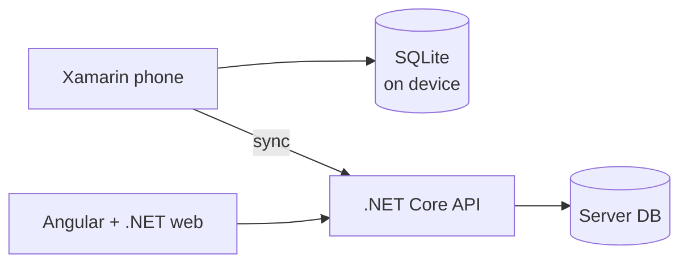
```mermaid
flowchart LR
  PH["Xamarin phone"] --> SQLI[("SQLite<br/>on device")]
  PH -->|"sync"| API[".NET Core API"]
  WEB["Angular + .NET web"] --> API
  API --> DB[("Server DB")]
```

#### Walk through — Theraoffice

First, why two clients? The clinic already had a desktop app. We added a web app. We did not throw the desktop away on day one.

1. **Vue** in the browser.
2. **WinForms / VB.NET** on the desktop. That is the old client.
3. Both call the same **C# API**.
4. The API checks the user with **Azure AD**. Then it reads and writes the **database**.

Notice that auth is not inside Vue and not inside WinForms. Auth is on the API. Azure AD is who you are.

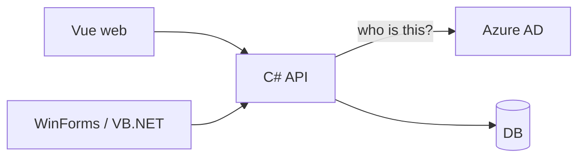
```mermaid
flowchart LR
  V["Vue web"] --> API["C# API"]
  W["WinForms / VB.NET"] --> API
  API -->|"who is this?"| AAD["Azure AD"]
  API --> DB[("DB")]
```

#### Walk through — Sky trac (microservices)

First, why a gateway? Order, Payment, and Product must not each do login, rate limit, and cache. That work is the same for every call. So we put it in one place.

Let us understand this with a picture. Draw left to right.

1. **Mobile** and **Angular** send the request.
2. **WAF** sits in front. It blocks common HTTP attacks before our code.
3. **API Gateway** is the door. It does **authorization**, **rate limiting**, **load balancing**, and **cache** for the most used values. It talks to **Azure AD**.
4. Then the gateway routes to **Order service**, **Payment service**, or **Product service**.
5. The services talk to the **database**.

This means: the browser never calls Payment by IP. It calls the gateway. The gateway knows who you are.

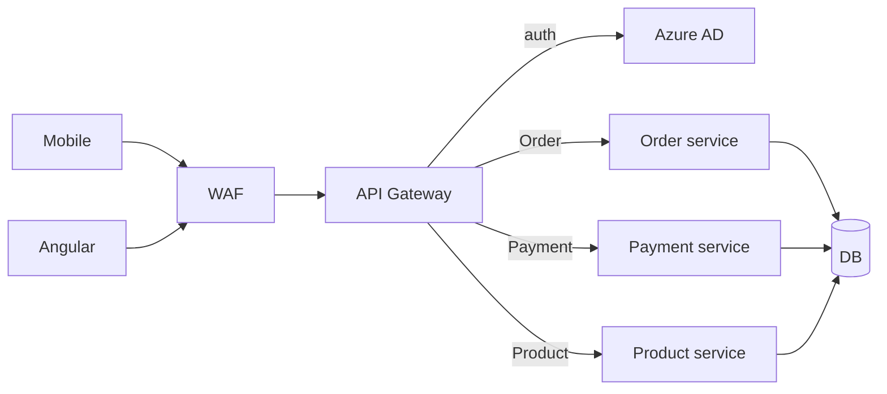
```mermaid
flowchart LR
  M["Mobile"] --> WAF["WAF"]
  A["Angular"] --> WAF
  WAF --> GW["API Gateway"]
  GW -->|"auth"| AAD["Azure AD"]
  GW -->|"Order"| ORD["Order service"]
  GW -->|"Payment"| PAY["Payment service"]
  GW -->|"Product"| PRD["Product service"]
  ORD --> DB[("DB")]
  PAY --> DB
  PRD --> DB
```

**What the gateway does**

| Job | Simple meaning |
|---|---|
| Authorization | May this user call this API? |
| Rate limiting | Slow down a noisy client |
| Load balancing | Send the call to a healthy instance |
| Caching | Keep the most used values close |

If she asks “what did **you** build?” name one service, one Angular screen, one gateway rule. Stop.

If she asks “does each service have its own database?” say what **you** shipped. The picture above is one DB box, the way we drew it. If a service later got its own database, say that. Do not invent it.

#### Watch-outs

- Do not mix Skytec SQLite with the Sky trac gateway. They are different products.
- Vue is Theraoffice. Angular is Skytec and Sky trac. Do not put both on the same product.

---

### Q. Cloud split — Angular on S3, API on ALB (keep this)

> **Say:** This is the same idea when the web files and the API sit on different hosts.
>
> The browser loads Angular from S3 and CloudFront. That is only the website files. Every API call goes through an HTTP interceptor. The interceptor attaches a JWT. Traffic then hits WAF, then ALB, then the APIs.
>
> Auth is its own concern. Order and inventory are separate services. SQL holds the business data. Documents go to S3. A queue handles work that must not sit in the HTTP request.

#### Walk through

First, why two URLs? Website files are static. The API is not. They can sit on different hosts.

Let us understand this with a picture. Draw left to right. Two paths leave the browser. Do not mix them.

**Path 1 — website files.** After `ng build` we have HTML, JS, CSS. These files sit in **S3**. **CloudFront** sits in front, so the user is not waiting on one bucket. No .NET is needed to show the page.

**Path 2 — data.** Buttons call APIs. Those calls do **not** go to S3. They go to **WAF**, then **ALB**, then a **.NET API**. The Angular interceptor adds `Authorization: Bearer` plus the JWT. This means the API knows who you are.

Why split Order and Inventory? A slow inventory job must not take down checkout. Each team can deploy on its own. SQL still holds the business rows. Files are too big for SQL — they go to a documents bucket. Email or payment that can wait goes on a **queue**. The shopper should not sit in the browser while that work finishes.

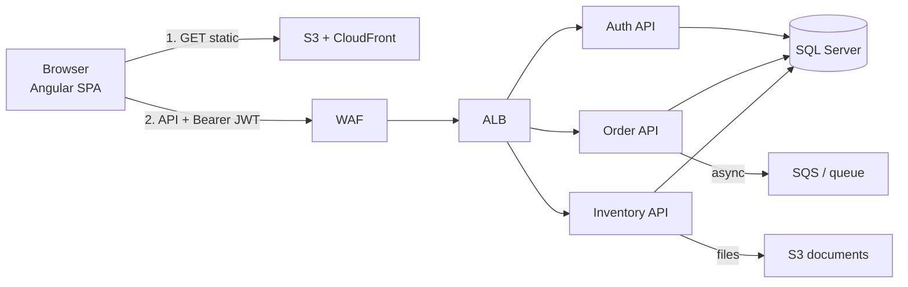
```mermaid
flowchart LR
  U["Browser<br/>Angular SPA"] -->|"1. GET static"| S3["S3 + CloudFront"]
  U -->|"2. API + Bearer JWT"| WAF["WAF"]
  WAF --> ALB["ALB"]
  ALB --> AUTH["Auth API"]
  ALB --> ORD["Order API"]
  ALB --> INV["Inventory API"]
  AUTH --> SQL[("SQL Server")]
  ORD --> SQL
  INV --> SQL
  ORD -->|"async"| Q["SQS / queue"]
  INV -->|"files"| DOC["S3 documents"]
```

If she asks “what did **you** build?” go back to **Skytec / Theraoffice / Sky trac**. Do not invent S3 modules you did not own.

#### Watch-outs

- “Everything is on one IIS server” is a different design. If yours was split, say split.
- CORS exists because path 1 and path 2 have **different URLs**.

---

## 2. Design patterns and .NET

### Q. Design patterns in your project. Why? What problem?

> **Say:** A pattern is a named solution to a problem we already hit.
>
> I shipped the **Repository pattern**. That is one door per table. `Add` does not call `SaveChanges`. I also shipped **Unit of Work**. Order and OrderLine save in one `SaveChanges`.
>
> I used **Singleton** only for cache and settings. I never used Singleton for `DbContext`.

#### Walk through

First, why do we use a pattern? Not because “we have an interface.” A pattern is a **problem you already hit**, then a **named way** you stopped hitting it.

Let us understand this with an example. We place an order. That is two tables: `Order` and `OrderLine`. The service must not write SQL. Both rows must save together, or neither.

**Repository pattern.** The controller should not talk to `DbSet` and SQL. The repository is the door to **one** table. `Add`, `Update`, `Get` live there. **`SaveChanges` does not.** If Add saves immediately, you cannot group Order and OrderLine.

Notice that injecting an interface is **DI**. The **Repository pattern** is the door to the table. Do not mix the two names.

<div class="mc-row" markdown="1">
<div class="mc-col mc-bad" markdown="1">
<span class="mc-lbl">Before — SQL in the service, SaveChanges in Add</span>

```csharp
public class OrderService {
  public void Place(Order o, OrderLine line) {
    using var db = new AppDbContext();
    db.Orders.Add(o);
    db.SaveChanges();           // header saved
    db.OrderLines.Add(line);
    db.SaveChanges();           // if this fails, header is already there
  }
}

// How they call it
new OrderService().Place(order, line);
```

</div>
<div class="mc-col mc-good" markdown="1">
<span class="mc-lbl">After — Repository pattern + one Unit of Work commit</span>

```csharp
public interface IOrderRepository {
  void Add(Order order);        // no SaveChanges
}
public interface IUnitOfWork {
  IOrderRepository Orders { get; }
  IOrderLineRepository Lines { get; }
  Task SaveChangesAsync();      // one commit
}

public class OrderService {
  private readonly IUnitOfWork _uow;
  public OrderService(IUnitOfWork uow) { _uow = uow; }
  public async Task Place(Order o, OrderLine line) {
    _uow.Orders.Add(o);
    _uow.Lines.Add(line);
    await _uow.SaveChangesAsync();
  }
}

// How they call it
await orderService.Place(order, line);
```

</div>
</div>

**Unit of Work.** The action is “place order”: header plus lines. Either **both** save or **neither**. UoW holds the repositories and calls **one** `SaveChangesAsync` at the end. Same scoped `DbContext`. In SQL that is `BEGIN TRAN` … `COMMIT`. If it fails, `ROLLBACK`. The SQL section has the side-by-side with C#.

**Singleton.** One settings or cache object for the **process**. Not for `DbContext`. A context tracks changes. It is not safe across requests.

This means: service → `IOrderRepository` → EF. Not service → `DbContext`.

| Pattern | Problem it solved | Where |
|---|---|---|
| **Repository pattern** | Controllers talking to EF directly; hard to test | `IOrderRepository` |
| Unit of Work | Two tables must save together or not at all | `IUnitOfWork.SaveChangesAsync()` |
| Singleton | Same settings object for the process | `AddSingleton<IAppSettings>` |

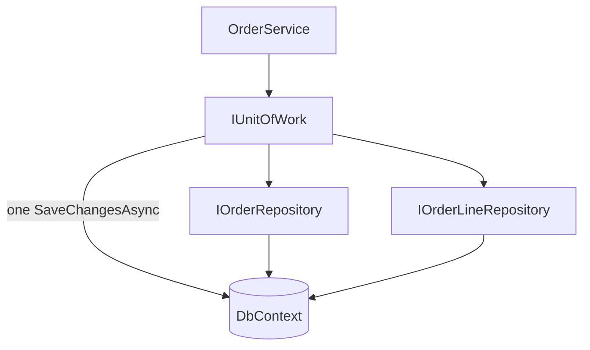
```mermaid
flowchart TD
  S["OrderService"] --> U["IUnitOfWork"]
  U --> R1["IOrderRepository"]
  U --> R2["IOrderLineRepository"]
  U -->|"one SaveChangesAsync"| DB[("DbContext")]
  R1 --> DB
  R2 --> DB
```

#### Watch-outs

- “I used Repository because we inject an interface” — that is DI, not the **Repository pattern**.
- `SaveChanges()` inside `Add` kills Unit of Work. She will mark it wrong.

---

### Q. Service registration for logging user activity and transactional data to SQL

> **Say:** When we log user activity and also save the order to SQL, both must share the same request. So **DbContext** and the activity writer are **Scoped**. That means one object per HTTP request, and one transaction.
>
> The logger sink, like Serilog, is **Singleton**. It has no per-user rows.
>
> I do not register `DbContext` as Singleton. It is not thread-safe. Two users would share one tracker.

#### Walk through

First, why does lifetime matter? The question is: **how many objects, and how long do they live?**

Let us take **one HTTP request**.

1. **Scoped** — one `DbContext` for that request. Controller, UoW, activity log — all use the **same** context. When the request ends, that context is gone. Next user gets a new one.
2. **Singleton** — one object for the whole process. Fine for `ILogger` (no user rows inside). Bad for `DbContext`. User B can see user A’s tracked entities.
3. **Transient** — a new object every time you ask. Fine for a small helper. Bad for `DbContext`: UoW and activity log get **two** contexts. You save the order but not the activity row.

This means: activity that goes to SQL **with the order** must be **Scoped** and must use the **same** context. Serilog to a file can be Singleton.

**Program.cs** — this is only registration. Notice that we do not `new` the controller here. We only tell the container how long each object lives.

<div class="mc-row" markdown="1">
<div class="mc-col mc-bad" markdown="1">
<span class="mc-lbl">Before — Program.cs, DbContext as Singleton</span>

```csharp
var builder = WebApplication.CreateBuilder(args);

builder.Services.AddSingleton<AppDbContext>();
builder.Services.AddSingleton<IActivityLog, ActivityLog>();
builder.Services.AddControllers();

var app = builder.Build();
app.MapControllers();
app.Run();
```

</div>
<div class="mc-col mc-good" markdown="1">
<span class="mc-lbl">After — Program.cs, SQL work Scoped</span>

```csharp
var builder = WebApplication.CreateBuilder(args);

builder.Services.AddDbContext<AppDbContext>(o =>
    o.UseSqlServer(cs));                    // Scoped
builder.Services.AddScoped<IUnitOfWork, UnitOfWork>();
builder.Services.AddScoped<IActivityLog, ActivityLog>();
builder.Services.AddSingleton<ILoggerFactory>(
    _ => new SerilogLoggerFactory());       // no user rows
builder.Services.AddControllers();

var app = builder.Build();
app.MapControllers();
app.Run();
```

</div>
</div>

**Controller** — this is how they call it. The constructor asks for the interfaces. The container fills them. Same request, same `DbContext`.

<div class="mc-row" markdown="1">
<div class="mc-col mc-bad" markdown="1">
<span class="mc-lbl">Before — controller news its own context</span>

```csharp
public class OrdersController : ControllerBase
{
    [HttpPost]
    public IActionResult Place(Order o)
    {
        using var db = new AppDbContext();
        db.Orders.Add(o);
        db.Activity.Add(new ActivityRow {
            Action = "PlaceOrder"
        });
        db.SaveChanges();
        return Ok();
    }
}
```

</div>
<div class="mc-col mc-good" markdown="1">
<span class="mc-lbl">After — controller gets UoW and activity log</span>

```csharp
public class ActivityLog : IActivityLog
{
    private readonly AppDbContext _db;
    public ActivityLog(AppDbContext db) { _db = db; }
    public void Write(string user, string action)
    {
        _db.Activity.Add(new ActivityRow {
            User = user, Action = action
        });
        // no SaveChanges — UoW commits with the order
    }
}

public class OrdersController : ControllerBase
{
    private readonly IUnitOfWork _uow;
    private readonly IActivityLog _log;
    public OrdersController(
        IUnitOfWork uow, IActivityLog log)
    {
        _uow = uow;
        _log = log;
    }

    [HttpPost]
    public async Task<IActionResult> Place(Order o)
    {
        _uow.Orders.Add(o);
        _log.Write(User.Identity.Name, "PlaceOrder");
        await _uow.SaveChangesAsync();
        return Ok();
    }
}
```

</div>
</div>

| What | Lifetime | Why not the others |
|---|---|---|
| `DbContext` / UoW / repositories | **Scoped** | Singleton = shared across users. Transient = extra contexts, broken UoW |
| Activity log **service** that uses DbContext | **Scoped** | Must share the request context |
| Serilog / `ILogger<T>` | **Singleton** | No per-user state |
| Pure helper with no state | Transient | Fine |

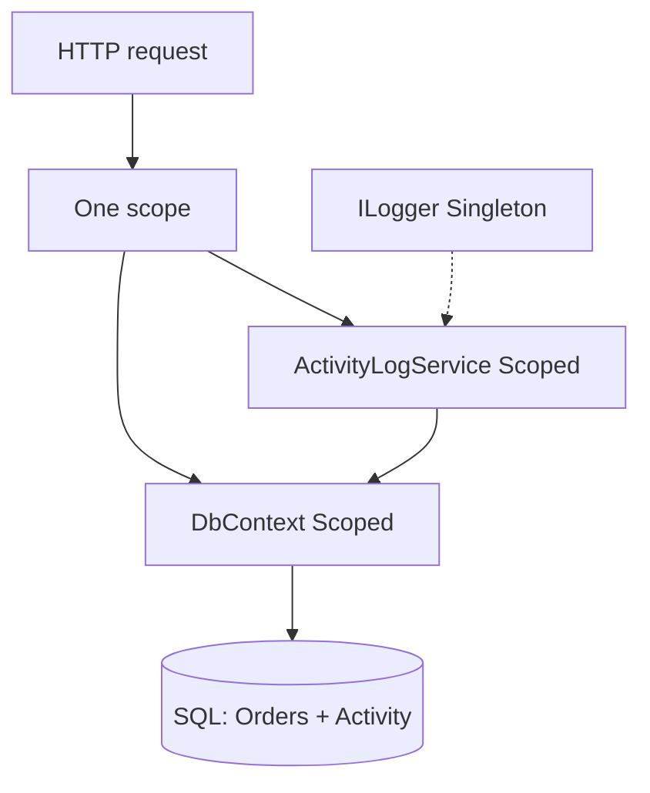
```mermaid
flowchart TD
  REQ["HTTP request"] --> SCOPE["One scope"]
  SCOPE --> CTX["DbContext Scoped"]
  SCOPE --> ACT["ActivityLogService Scoped"]
  ACT --> CTX
  CTX --> SQL[("SQL: Orders + Activity")]
  LOG["ILogger Singleton"] -.-> ACT
```

#### Watch-outs

- “Everything Singleton because it is faster” — until two users share a context.
- Logging to SQL in the same transaction is not the same as Serilog to a file.

---

### Q. Custom middleware for authentication on specific actions, not all requests

> **Say:** Middleware is a pipe around HTTP. `next()` goes in. The rest of the pipe runs. Then the code after `next()` sees the response.
>
> I wrote a **SessionId** middleware. Every API after login must send `X-Session-Id`. If the header is missing, we return 401. We add the class with `app.UseMiddleware` in `Program.cs`.
>
> For a few actions only, I do not put that check on the global pipe. I use an **action filter**. Middleware is for every request. A filter is for one action or one controller.

#### Walk through

Let us understand middleware. The request goes through a list of steps, then comes **back** out the same list. That list is the pipeline.

1. Request enters: exception handler, CORS, HTTPS.
2. `UseAuthentication` reads the JWT if it is there.
3. Custom middleware can check a **session id** on every call.
4. Then the controller action runs.
5. On the way out, code after `next()` can log the status code.

Let us understand this with an example. After login we give a session id. Every later call must send that id in the header `X-Session-Id`. Login and health have no session yet, so we skip those paths.

**1. The middleware class**

```csharp
public class SessionIdMiddleware
{
    private readonly RequestDelegate _next;
    public SessionIdMiddleware(RequestDelegate next)
    {
        _next = next;
    }

    public async Task InvokeAsync(HttpContext ctx)
    {
        var path = ctx.Request.Path;
        if (path.StartsWithSegments("/health") ||
            path.StartsWithSegments("/login"))
        {
            await _next(ctx);
            return;
        }

        var sessionId = ctx.Request.Headers["X-Session-Id"]
            .ToString();
        if (string.IsNullOrWhiteSpace(sessionId))
        {
            ctx.Response.StatusCode = 401;
            await ctx.Response.WriteAsync(
                "Session id is missing.");
            return;                 // do not call next()
        }

        await _next(ctx);
    }
}
```

**2. How we add it in Program.cs**

```csharp
var builder = WebApplication.CreateBuilder(args);
builder.Services.AddControllers();

var app = builder.Build();

app.UseHttpsRedirection();
app.UseAuthentication();
app.UseMiddleware<SessionIdMiddleware>();
app.UseAuthorization();
app.MapControllers();
app.Run();
```

Notice that the class is not registered as Scoped. The pipeline creates it. `RequestDelegate` is the rest of the pipe. If session id is missing, we **do not** call `next()`. The controller never runs.

**How they call it** — the Angular interceptor puts the header on every `HttpClient` call:

```ts
req = req.clone({
  setHeaders: { "X-Session-Id": sessionId }
});
```

Now her extra question: **only some actions**, not all.

If you `app.Use` “must be admin” on the whole app, health checks and login break. Session id can skip `/login` by path. Admin create-user is **one method**. That is a **filter**, not a global `Use`.

**When middleware vs when a filter**

| | Middleware | Filter (action / endpoint) |
|---|---|---|
| Where it runs | The HTTP pipe, before MVC | After routing picked the action |
| Knows the action name? | No, unless you look it up | Yes |
| Use when | Same check for **almost every** request | Check for **one** action or controller |
| Example | Session id, correlation id | `[Authorize(Policy = "Admin")]` |

<div class="mc-row" markdown="1">
<div class="mc-col mc-alt" markdown="1">
<span class="mc-lbl">Middleware — every request (session id)</span>

```csharp
app.UseMiddleware<SessionIdMiddleware>();
```

</div>
<div class="mc-col mc-alt" markdown="1">
<span class="mc-lbl">Filter — one action only (admin)</span>

```csharp
public class AdminOnlyAttribute
    : ActionFilterAttribute
{
    public override void OnActionExecuting(
        ActionExecutingContext ctx)
    {
        if (!ctx.HttpContext.User.IsInRole("Admin"))
            ctx.Result = new ForbidResult();
    }
}

[AdminOnly]
[HttpPost("users")]
public IActionResult Create() { ... }
```

</div>
</div>

Notice that middleware sits on the **pipe**. It does not know the action name unless you add extra work. A filter **does** know the action.

<div class="mc-row" markdown="1">
<div class="mc-col mc-bad" markdown="1">
<span class="mc-lbl">Before — admin check on every request</span>

```csharp
app.Use(async (ctx, next) => {
  if (!ctx.User.IsInRole("Admin")) {
    ctx.Response.StatusCode = 403;
    return;                 // health + login also die
  }
  await next();
});
app.UseAuthentication();
```

</div>
<div class="mc-col mc-good" markdown="1">
<span class="mc-lbl">After — JWT global, extra auth on the action</span>

```csharp
app.UseAuthentication();
app.UseMiddleware<SessionIdMiddleware>();
app.UseAuthorization();

[AdminOnly]
[HttpPost("users")]
public IActionResult Create() { ... }

[AllowAnonymous]
[HttpGet("health")]
public IActionResult Health() => Ok();
```

</div>
</div>

<div class="mc-row" markdown="1">
<div class="mc-col mc-bad" markdown="1">
<span class="mc-lbl">Before — one pipe for every URL</span>

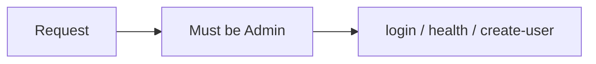
```mermaid
flowchart LR
  IN["Request"] --> MW["Must be Admin"]
  MW --> ALL["login / health / create-user"]
```

</div>
<div class="mc-col mc-good" markdown="1">
<span class="mc-lbl">After — session middleware, filter only on admin</span>

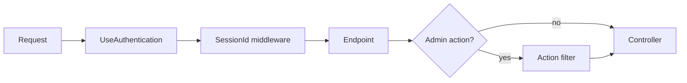
```mermaid
flowchart LR
  IN["Request"] --> AUTH["UseAuthentication"]
  AUTH --> SID["SessionId middleware"]
  SID --> END["Endpoint"]
  END --> F{"Admin action?"}
  F -->|yes| FILT["Action filter"]
  F -->|no| CTRL["Controller"]
  FILT --> CTRL
```

</div>
</div>

#### Watch-outs

- Middleware does not know the action name unless you add extra work. Filters know the action.
- The pipe **does** run again on the way out. That is how you log duration.
- Do not put “must be Admin” in SessionId middleware. That belongs on the action.

---

### Q. Extension method — where did you use it?

> **Say:** An extension method is a static method on a static class. The first parameter is `this T`. It looks like an instance method.
>
> I used it on a string to format a zip code: `"635601".FormatZipCode()` becomes `TN-635601`. I used it for query filters, like `WhereOpen()`. I used it for DI, like `AddApplication()`.

#### Walk through

You cannot add a method inside `string` or inside `IQueryable<Order>`. Those types are not yours. An **extension method** lets you write `zip.FormatZipCode()` as if it belonged to the string.

Let us understand this with an example. The pin code is `635601`. On the screen we want `TN-635601`. If we write `"TN-" + zip` in ten places, one place will forget the prefix.

Points to remember:

1. Class must be `static`.
2. Method must be `static`.
3. First parameter is `this` plus the type you are extending.

<div class="mc-row" markdown="1">
<div class="mc-col mc-bad" markdown="1">
<span class="mc-lbl">Before — prefix copied in every screen</span>

```csharp
public string ShowPin() {
  string zip = "635601";
  return "TN-" + zip;          // TN-635601
}

public string PrintLabel() {
  string zip = order.Pin;
  return "TN-" + zip;          // copied
}
```

</div>
<div class="mc-col mc-good" markdown="1">
<span class="mc-lbl">After — FormatZipCode on string</span>

```csharp
public static class StringExtensions
{
    public static string FormatZipCode(
        this string zip)
        => "TN-" + zip;
}

// How they call it
"635601".FormatZipCode();      // TN-635601
order.Pin.FormatZipCode();
```

</div>
</div>

Same idea on a query. Why? So the controller does not copy `Where(o => o.Status == "Open")` in twelve places. Keep it `IQueryable` so LINQ still runs in SQL.

`services.AddApplication()` in `Program.cs` is an extension on `IServiceCollection`. That is the same pattern.

<div class="mc-row" markdown="1">
<div class="mc-col mc-bad" markdown="1">
<span class="mc-lbl">Before — copy the same Where in every action</span>

```csharp
public IActionResult Open() {
  return Ok(db.Orders
    .Where(o => o.Status == "Open")
    .ToList());
}
public IActionResult OpenReport() {
  return Ok(db.Orders
    .Where(o => o.Status == "Open")   // copied
    .ToList());
}
```

</div>
<div class="mc-col mc-good" markdown="1">
<span class="mc-lbl">After — extension method on IQueryable</span>

```csharp
public static class OrderQueryExtensions
{
    public static IQueryable<Order> WhereOpen(
        this IQueryable<Order> q) =>
        q.Where(o => o.Status == "Open");
}

// How they call it
db.Orders.WhereOpen().ToList();
services.AddApplication();
```

</div>
</div>

#### Watch-outs

- If the method calls `.ToList()` inside, SQL is no longer deferred.
- Extension methods cannot see `private` members.

---

### Q. Authenticate and authorize a JWT

> **Say:** Authenticate means who you are. Authorize means what you may do.
>
> Login issues a short access JWT. The Angular interceptor sends `Authorization: Bearer` plus the token. The API checks the signature, expiry, issuer, and audience. Then `[Authorize]` reads the claims.
>
> Angular guards only hide the menu. The API still decides.

#### Walk through

First, two words people mix up.

**Authenticate** = prove who you are. Login succeeds. Server builds a JWT: header, payload (user id, role, `exp`), signature. Anyone can **read** the payload. It is Base64, not encryption. Only someone with the key can **forge** a valid signature.

**Authorize** = now that we know who, may they do **this** action. Role `User` cannot call `POST /admin/users`.

Let us say the flow in order:

1. Login API checks password (or SSO).
2. It returns a **short** access token and a **longer** refresh token.
3. Angular stores them. Be ready to say where, and that XSS is the risk for localStorage.
4. Interceptor puts the access token on **every** `HttpClient` call.
5. API checks signature, expiry, issuer, audience. Then role/claim.
6. Access expired → interceptor calls refresh **once** → retries. Refresh failed → logout.

Angular `canActivate` hiding a menu is **not** security. A user can still call the API from Postman. The API must refuse.

<div class="mc-row" markdown="1">
<div class="mc-col mc-bad" markdown="1">
<span class="mc-lbl">Before — each component attaches the token</span>

```ts
this.http.get('/api/orders', {
  headers: { Authorization: 'Bearer ' + localStorage.getItem('jwt') }
});
```

</div>
<div class="mc-col mc-good" markdown="1">
<span class="mc-lbl">After — interceptor on every HttpClient call</span>

```ts
intercept(req: HttpRequest<unknown>, next: HttpHandler) {
  const t = this.tokens.access;
  const clone = req.clone({
    setHeaders: { Authorization: `Bearer ${t}` }
  });
  return next.handle(clone);
}

// How they call it
this.orderApi.list().subscribe(...);  // interceptor runs
```

</div>
</div>

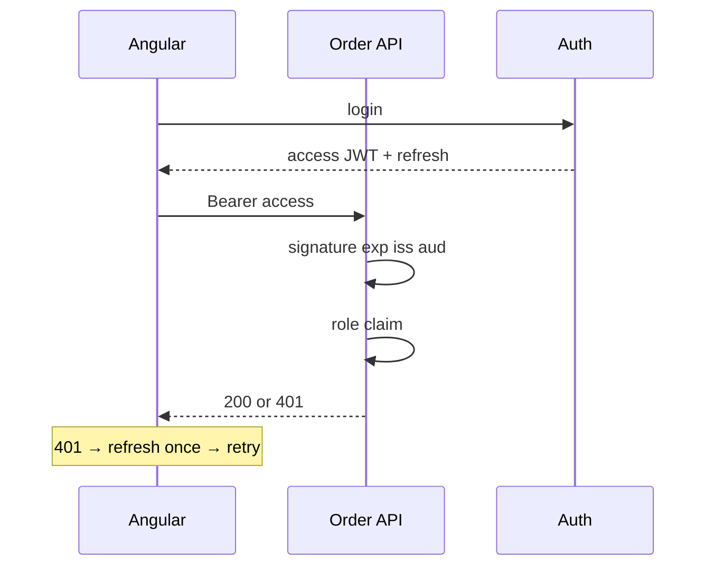
```mermaid
sequenceDiagram
  participant SPA as Angular
  participant API as Order API
  participant IdP as Auth
  SPA->>IdP: login
  IdP-->>SPA: access JWT + refresh
  SPA->>API: Bearer access
  API->>API: signature exp iss aud
  API->>API: role claim
  API-->>SPA: 200 or 401
  Note over SPA: 401 → refresh once → retry
```

#### Watch-outs

- JWT is a **format**. OAuth is **how** you get tokens. SSO is **which company logs you in**.
- Do not put secrets in the payload. It is readable.

---

### Q. Two interfaces, same method, one class — which one am I calling?

> **Say:** When two interfaces have the same method, I use **explicit interface implementation** in C#. The class maps each interface method separately.
>
> I call `Send` through the interface type, not through the class type. So `IEmail e = new Notifier(); e.Send("hi")` is email. `ISms` is SMS.

#### Walk through

Let us understand this with an example. Two interfaces both have `void Send(string)`. If you write one `public void Send`, **both** interfaces share that one method.

She wants the other case: email Send is **not** SMS Send.

You write `void IEmail.Send` and `void ISms.Send`. These are **not** public `Send` on the class. You must hold the object as `IEmail` or `ISms`. Then the compiler knows which body to call.

Notice that `new Notifier().Send("hi")` does not compile. That is the point. The compiler does not pick randomly. It picks by **the type of the variable**.

<div class="mc-row" markdown="1">
<div class="mc-col mc-bad" markdown="1">
<span class="mc-lbl">Before — one public Send for both interfaces</span>

```csharp
interface IEmail { void Send(string m); }
interface ISms   { void Send(string m); }

class Notifier : IEmail, ISms
{
    public void Send(string m) { /* one body — email AND sms? */ }
}

// How they call it
new Notifier().Send("hi");  // compiles — but which channel?
```

</div>
<div class="mc-col mc-good" markdown="1">
<span class="mc-lbl">After — explicit interface implementation</span>

```csharp
interface IEmail { void Send(string m); }
interface ISms   { void Send(string m); }

class Notifier : IEmail, ISms
{
    void IEmail.Send(string m) { /* SMTP */ }
    void ISms.Send(string m)   { /* SMS  */ }
}

// How they call it
IEmail e = new Notifier(); e.Send("hi");  // email
ISms   s = new Notifier(); s.Send("hi");  // sms
// new Notifier().Send("hi");  // does not compile
```

</div>
</div>

#### Watch-outs

- `new Notifier().Send("hi")` does not compile. That is the point.
- Do not say “the compiler picks randomly.” It picks by **the type of the variable**.

---

### Q. Async vs await

> **Say:** `async` marks the method. `await` gives the thread back while I/O waits. Then the method continues. It is not a new OS thread for every call.
>
> If B needs A, I write `await A(); await B();`. If the work is independent, I write `await Task.WhenAll(A(), B())`.

#### Walk through

SQL and HTTP are slow compared with CPU. If you block a thread with `.Result` or `.Wait()`, that thread sits idle. The server runs out of threads.

`async` / `await` means: start the I/O, **give the thread back to the pool**, when SQL answers, **continue** this method. Same request. Not always the same thread after await.

If B needs A:

<div class="mc-row" markdown="1">
<div class="mc-col mc-bad" markdown="1">
<span class="mc-lbl">Before — block the thread</span>

```csharp
var order = GetOrder(id).Result;     // thread sits idle
var lines = GetLines(order.Id).Wait();
```

</div>
<div class="mc-col mc-good" markdown="1">
<span class="mc-lbl">After — await, then WhenAll when independent</span>

```csharp
var order = await GetOrder(id);
var lines = await GetLines(order.Id);

// independent work — start together
await Task.WhenAll(GetUser(), GetOrders(), GetFacilities());
```

</div>
</div>

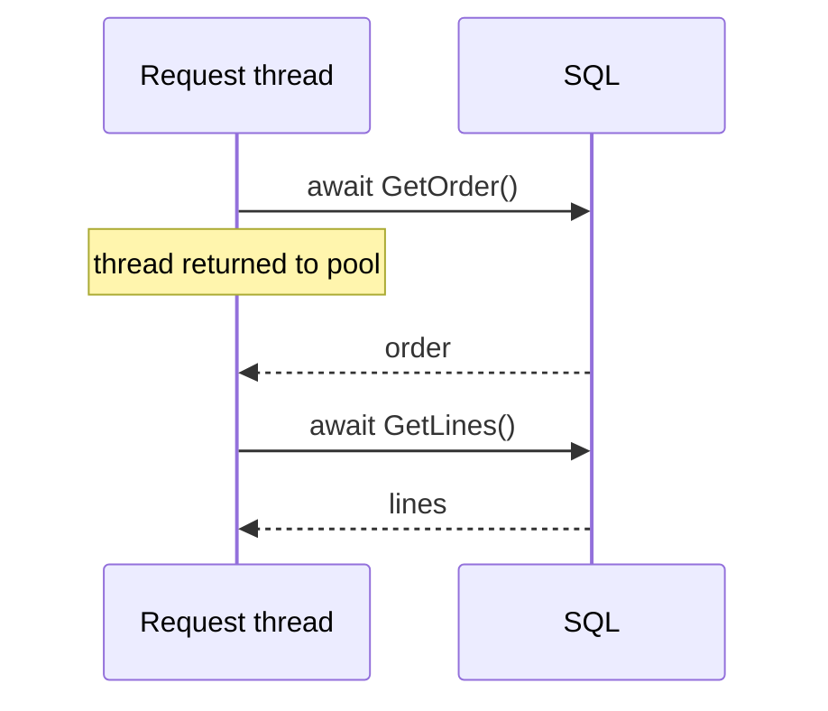
```mermaid
sequenceDiagram
  participant T as Request thread
  participant DB as SQL
  T->>DB: await GetOrder()
  Note over T: thread returned to pool
  DB-->>T: order
  T->>DB: await GetLines()
  DB-->>T: lines
```

#### Watch-outs

- `async void` except event handlers — exceptions disappear.
- Nested `await` does not freeze the machine. The thread is not spinning.

---

### Q. How does Singleton work across browsers?

> **Say:** Singleton does not work across browsers. Two browsers are two clients. Singleton is one instance per process — one IIS or Kestrel worker.
>
> A static field is shared by users on that server. That is why a Singleton `DbContext` is dangerous. It is not because Chrome shares memory with Edge.

#### Walk through

People hear “one instance” and think “one instance for the whole internet.” That is wrong.

1. Browser A and Browser B are two **clients**. They do not share JavaScript memory.
2. They both call **your API process**. Inside **that process**, a Singleton is one object.
3. A Singleton cache of country codes is shared by all users on that server. That is fine.
4. A Singleton `DbContext` is also shared by all users on that server. That is bad.

Two ECS tasks = **two** Singletons. Do not store “the current user” in a static field.

<div class="mc-row" markdown="1">
<div class="mc-col mc-bad" markdown="1">
<span class="mc-lbl">Before — “one instance for the internet”</span>

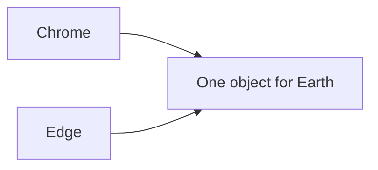
```mermaid
flowchart LR
  B1["Chrome"] --> ONE["One object for Earth"]
  B2["Edge"] --> ONE
```

</div>
<div class="mc-col mc-good" markdown="1">
<span class="mc-lbl">After — one object per API process</span>

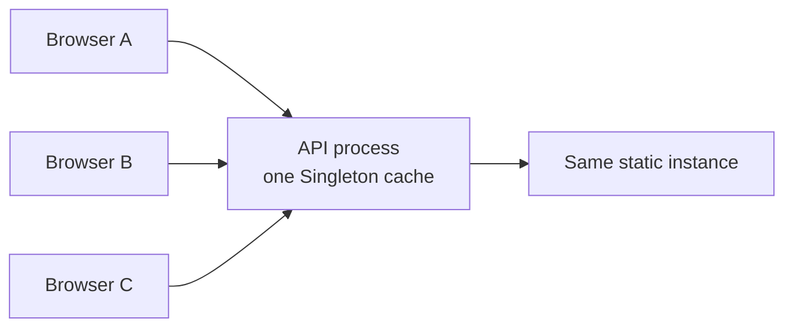
```mermaid
flowchart LR
  B1["Browser A"] --> API["API process<br/>one Singleton cache"]
  B2["Browser B"] --> API
  B3["Browser C"] --> API
  API --> MEM["Same static instance"]
```

</div>
</div>

#### Watch-outs

- Singleton is not one object for all browsers on Earth.
- Scoped `DbContext` is the default for a reason.

---

### Q. Static class vs Singleton class — how do you access the method?

> **Say:** A static class has no object. You call the method on the type name. For example, `CacheHelper.Get("sku")`.
>
> A Singleton class still has one object. You call the method on that instance. For example, `PriceCache.Instance.Get("sku")`. Or you inject `IPriceCache` and call `_cache.Get("sku")`.
>
> Singleton can implement an interface. You can mock it. Static cannot.

#### Walk through

First, why does she mix these two? Both look like “there is only one.” The difference is **how you call the method**.

Let us understand this with an example. We need country names or a price list. One copy for the process is enough.

**Static class.** No constructor. No instance. The method lives on the class. Tests cannot swap a fake without rewriting the caller.

**Singleton class.** Private constructor. A static field holds the **one** object. Callers use `Instance`, or DI gives them that object. The method is an **instance** method.

Notice that `AddSingleton<IPriceCache, PriceCache>()` is the DI way to get the same idea. You still call `_cache.Get`. You do not write `PriceCache.Get`.

This means: if she asks “how do you access the method?” — static = type name. Singleton = object (`Instance` or injected field).

<div class="mc-row" markdown="1">
<div class="mc-col mc-bad" markdown="1">
<span class="mc-lbl">Static class — call on the type name</span>

```csharp
public static class CacheHelper {
  public static string Get(string key) {
    return MemoryCache.Default.Get(key);
  }
}

public class OrderService {
  public decimal Price(string sku) {
    var raw = CacheHelper.Get(sku);   // glued — cannot mock
    return decimal.Parse(raw);
  }
}

// How they call it
CacheHelper.Get("sku");
new OrderService().Price("A1");
```

</div>
<div class="mc-col mc-good" markdown="1">
<span class="mc-lbl">Singleton class — call on the instance</span>

```csharp
public class PriceCache : IPriceCache {
  private static readonly PriceCache _i = new PriceCache();
  private PriceCache() { }
  public static PriceCache Instance => _i;
  public string Get(string key) { /* ... */ }
}

public class OrderService {
  private readonly IPriceCache _cache;
  public OrderService(IPriceCache cache) { _cache = cache; }
  public decimal Price(string sku) {
    return decimal.Parse(_cache.Get(sku));
  }
}

// How they call it
PriceCache.Instance.Get("sku");          // classic Singleton
builder.Services.AddSingleton<IPriceCache, PriceCache>();
orderService.Price("A1");                // method on the object
```

</div>
</div>

| | Static class | Singleton class |
|---|---|---|
| Object? | No | Yes — one |
| How you call the method | `CacheHelper.Get()` | `Instance.Get()` or `_cache.Get()` |
| Interface / mock in tests | Hard | Yes |
| Private constructor | Not needed — cannot `new` | Yes, so others cannot `new` |

#### Watch-outs

- “Static and Singleton are the same” — they are not. One is a type name. One is an object.
- Do not make the **Repository pattern** a static class. You cannot inject `IOrderRepository`.

---

## 3. Microservices, APIs, AWS

### Q. How do microservices communicate? How do you identify the other service?

> **Say:** When the user is waiting on the screen, we call the other service with HTTP. That is sync. When the work can finish later, we put a message on a queue. That is async.
>
> I identify the other service by name in DNS or Cloud Map, plus a **service token**. I never hard-code an IP.

#### Walk through

First, why two styles? Pick by this: **is the user waiting on the screen?**

**Sync (HTTP).** Order API needs stock **now**. It calls Inventory with HTTP and a **service token**. Fast. If Inventory is down, checkout fails unless you have a fallback.

**Async (queue).** After “order placed,” send email. Put a message on **SQS**. A consumer does the work. The user already got “placed.” If the consumer is down, messages wait. You need retry and a dead-letter queue.

**Identify the other service.** Not an IP that changes when a container dies. Use a **DNS name** or **Cloud Map**. The token also says the audience: this token is **for Inventory**.

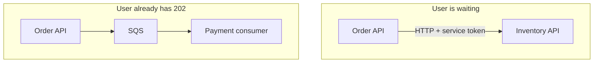
```mermaid
flowchart TB
  subgraph sync [User is waiting]
    O1["Order API"] -->|"HTTP + service token"| I1["Inventory API"]
  end
  subgraph async [User already has 202]
    O2["Order API"] --> Q["SQS"]
    Q --> P["Payment consumer"]
  end
```

#### Watch-outs

- “We use both REST and Kafka” with no **when** is a weak answer.
- Hard-coded IP fails the identify question.

---

### Q. What is a service token?

> **Say:** A service token is a short-lived token for the calling application, not for the human. We get it with **client credentials** — app id and secret, or managed identity.
>
> The user’s JWT proves the shopper. The service token proves Order API is allowed to call Inventory.

#### Walk through

Let us understand two identities on one checkout.

1. **Human.** “I am user 42. I clicked Buy.” That is the **user JWT**. Angular sends it to **Order API**.
2. **Application.** “I am the Order API. I may ask Inventory for stock.” That is the **service token**. Order API gets it from Identity with **client id + secret**. Inventory checks that token, not the shopper’s cookie.

Why not forward the user JWT to Inventory? Then a stolen user token could call Inventory directly. Service tokens keep **machine-to-machine** separate from **user-to-API**.

Lifetime is short. When it expires, see the next question.

#### Watch-outs

- Service token is not the Angular access token with a different name.
- Client credentials = the app talks. No user at a login page.

---

### Q. Secure APIs. How does one service allow another to respond? AuthZ between services. Token expires mid-call

> **Say:** We use HTTPS. The user JWT is checked on the edge API. Roles and claims decide what that user may do. Service to service uses mTLS or a service JWT.
>
> If the service token expires mid-call, we catch 401, request a new token, retry once, then fail. We do not loop. We do not send the user JWT to a downstream service unless that was the design.

#### Walk through

**Edge.** HTTPS only. User JWT checked on Order API. Roles: this user may create orders.

**Inside.** Inventory does not accept anonymous calls just because “it is internal.” It wants a **service token** (or mTLS).

**Allow another service to respond.** Inventory checks: token valid, `aud` is Inventory. Then it returns stock.

**Token expires mid-call.** Order got a token at 12:00. At 12:04 Inventory says 401. Order must:

1. Ask Identity for a **new** token.
2. Retry Inventory **once**.
3. If it still fails, fail the user. **No loop.**

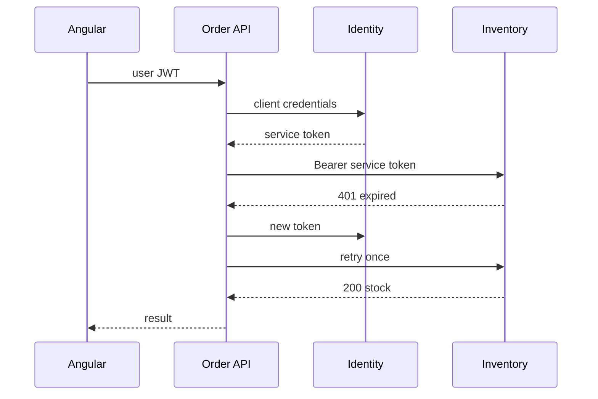
```mermaid
sequenceDiagram
  participant UI as Angular
  participant ORD as Order API
  participant ID as Identity
  participant INV as Inventory
  UI->>ORD: user JWT
  ORD->>ID: client credentials
  ID-->>ORD: service token
  ORD->>INV: Bearer service token
  INV-->>ORD: 401 expired
  ORD->>ID: new token
  ORD->>INV: retry once
  INV-->>ORD: 200 stock
  ORD-->>UI: result
```

#### Watch-outs

- Retry **once**, not until it works.
- You may cache the service token. Refresh before `exp`, or on 401.

---

### Q. Transactions across multiple microservices

> **Say:** When one transaction involves multiple microservices, we cannot use one SQL transaction for all the databases.
>
> So, we use a **Saga** pattern. Each service completes its own transaction and commits it.
>
> If something fails in the next service, we do a compensating action to undo the previous work. For example, we can refund the payment or release the stock.
>
> We also use the **Outbox** pattern so that saving the order and sending the event do not get separated.
>
> Every microservice does its own commit. If something fails later, instead of a database rollback across services, we perform an opposite action to compensate the previous operation.

#### Walk through

In one database, `BEGIN TRAN` … `COMMIT` wraps Order and OrderLine. Two microservices = **two databases**. SQL Server cannot lock a row in Payment’s database from Order’s transaction.

So we use a **saga**: local commits, then **compensate** if a later step fails.

Example: place order.

1. Order service inserts the order. Committed.
2. Inventory reserves stock. Committed.
3. Payment fails. You do not magically undo step 1 across servers. You **compensate**: release stock, mark order cancelled.

**Outbox:** save the order and “the event I must publish” in the **same** local transaction. A worker publishes the event. You never get “row saved, message lost.”

<div class="mc-row" markdown="1">
<div class="mc-col mc-bad" markdown="1">
<span class="mc-lbl">Before — one TransactionScope across two databases</span>

```csharp
using (var scope = new TransactionScope()) {
  orderDb.SaveChanges();      // Order DB
  paymentDb.SaveChanges();    // Payment DB — DTC / fails
  scope.Complete();
}
```

</div>
<div class="mc-col mc-good" markdown="1">
<span class="mc-lbl">After — saga: local commit + compensate</span>

```csharp
await _orders.Create(order);          // local commit
await _inventory.Reserve(sku, qty);   // local commit
try {
  await _payments.Capture(order.Id);
} catch {
  await _inventory.Release(sku, qty); // compensate
  await _orders.Cancel(order.Id);
  throw;
}
```

</div>
</div>

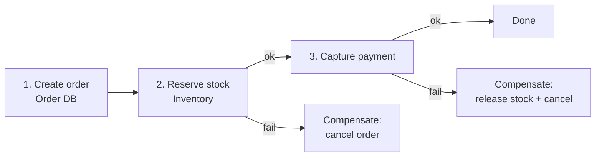
```mermaid
flowchart LR
  A["1. Create order<br/>Order DB"] --> B["2. Reserve stock<br/>Inventory"]
  B -->|ok| C["3. Capture payment"]
  C -->|ok| D["Done"]
  B -->|fail| X["Compensate:<br/>cancel order"]
  C -->|fail| Y["Compensate:<br/>release stock + cancel"]
```

#### Watch-outs

- “We wrap all services in one TransactionScope” is the answer she wants to reject.
- Name choreography vs orchestrator only if you built it.

---

### Q. Why WAF?

> **Say:** A Web Application Firewall sits in front of ALB or CloudFront. It blocks common HTTP attacks, like SQL injection, XSS, and bots, before they hit my API.
>
> It does not replace JWT. It does not replace SQL parameters.

#### Walk through

First, why WAF? Your API still uses parameterized SQL and JWT. WAF is an extra **gate on the public internet**.

It looks at HTTP: bad payloads, floods, scanners. Cheap to stop at the edge. If you skip WAF, every probe hits ECS.

It is **not** login. A stolen JWT still passes WAF. Layers: WAF + TLS + JWT + SQL parameters.

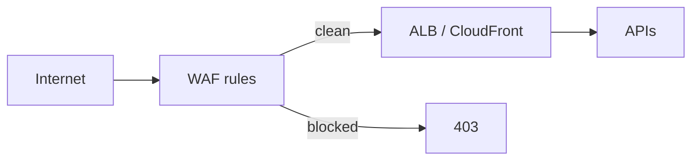
```mermaid
flowchart LR
  NET["Internet"] --> WAF["WAF rules"]
  WAF -->|clean| ALB["ALB / CloudFront"]
  WAF -->|blocked| DROP["403"]
  ALB --> API["APIs"]
```

#### Watch-outs

- “WAF means we do not need `[Authorize]`” — false.
- Place it **in front** of ALB or on CloudFront, not after the container.

---

### Q. Azure Logic Apps vs Function Apps

> **Say:** A Function App is my C# code. It is short. It is event-triggered, like HTTP, queue, or timer.
>
> A Logic App is a designer workflow. It connects SaaS, like email, HTTP, and approval. I write Functions for domain logic. I use Logic Apps when the work is mostly glue.
>
> If the stack is AWS, I say Lambda versus Step Functions. Then I stop unless I used Azure.

#### Walk through

First, why two products? Azure has two ways to run work that is **not** a full website. She is checking: do you know **glue vs code**?

Let us understand this with an example. An order is placed. We must:

1. Send a confirmation email.
2. Wait for a manager to **approve** a refund. That wait can be two days.
3. Then call our Order API.

If I write this as **one Function**, I write HTTP, SMTP, and a wait. Functions have a **timeout**. A manager may take two days. The Function dies. That is the pain.

**Function App — my code.** You write C#. Trigger = HTTP, timer, queue. You own the tax calculation, the discount rule, the JWT check. Short run. Then stop.

**Logic App — boxes on a designer.** Blob arrives, send mail, wait for approval, then HTTP. Little or no C#. Good when the work **is** the connectors. The designer is the product. You do not need to open Azure while you answer — the screenshots below are the same designer.

Notice that they are **not** the same thing with a different name. One is a class you compile. One is a workflow you draw.

This means: domain rule → Function. Glue and long wait → Logic App.

<div class="mc-row" markdown="1">
<div class="mc-col mc-alt" markdown="1">
<span class="mc-lbl">Function App — you write C# (code)</span>

```csharp
[Function("CalcTax")]
public async Task<HttpResponseData> Run(
    [HttpTrigger(AuthorizationLevel.Function, "post")]
    HttpRequestData req)
{
    var order = await req.ReadFromJsonAsync<Order>();
    var tax = order.Total * 0.18m;   // my domain rule
    return await req.WriteJsonAsync(new { tax });
}

// How they call it
// POST https://myapp.azurewebsites.net/api/CalcTax
```

<div class="shot-wrap">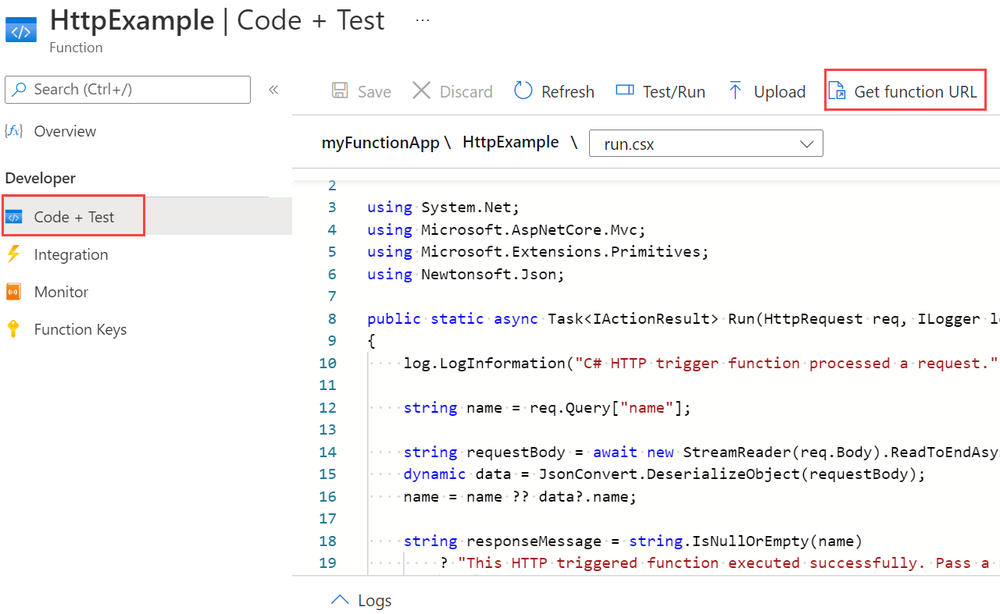</div>
<p class="shot-cap">Azure portal: Function App — HTTP function URL. This is <b>code</b> you host. (Microsoft Learn screenshot, saved here.)</p>

</div>
<div class="mc-col mc-alt" markdown="1">
<span class="mc-lbl">Logic App — designer workflow (glue)</span>

<div class="shot-wrap">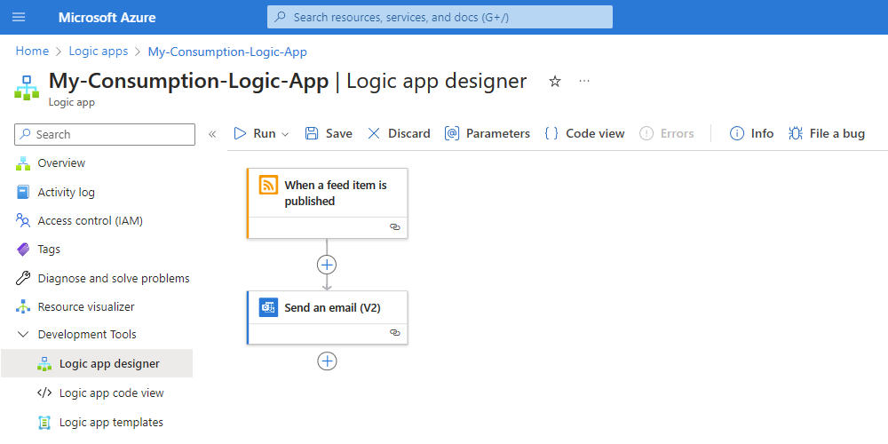</div>
<p class="shot-cap">Azure Logic Apps designer: trigger then Send an email. Boxes, not a C# class. (Microsoft Learn screenshot, saved here.)</p>

<div class="shot-wrap">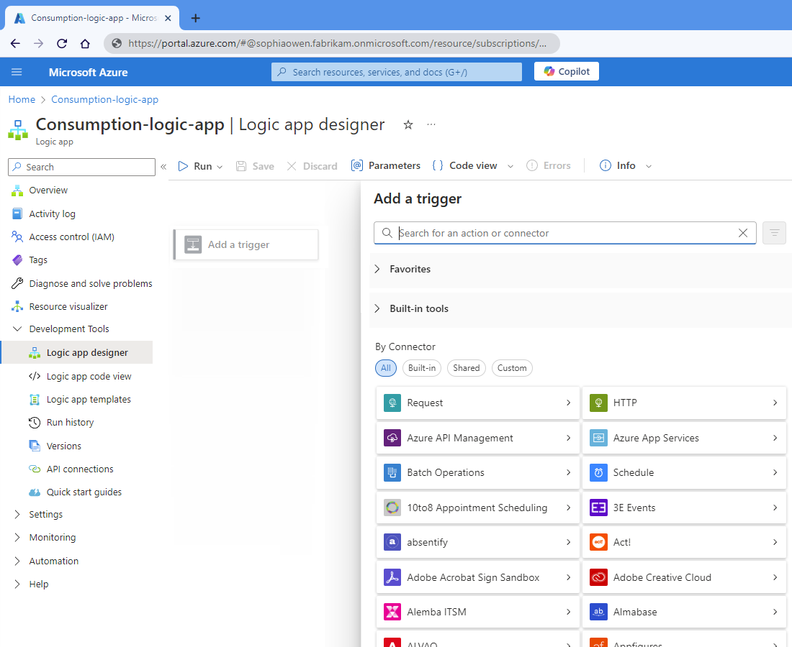</div>
<p class="shot-cap">Add a trigger: connector gallery (RSS, Recurrence, HTTP, Office 365). This is why Logic Apps exists — glue.</p>

</div>
</div>

**A bigger Logic App (enterprise connectors).** Same idea: when blob / HTTP / approval is the work, you draw it.

<div class="shot-wrap">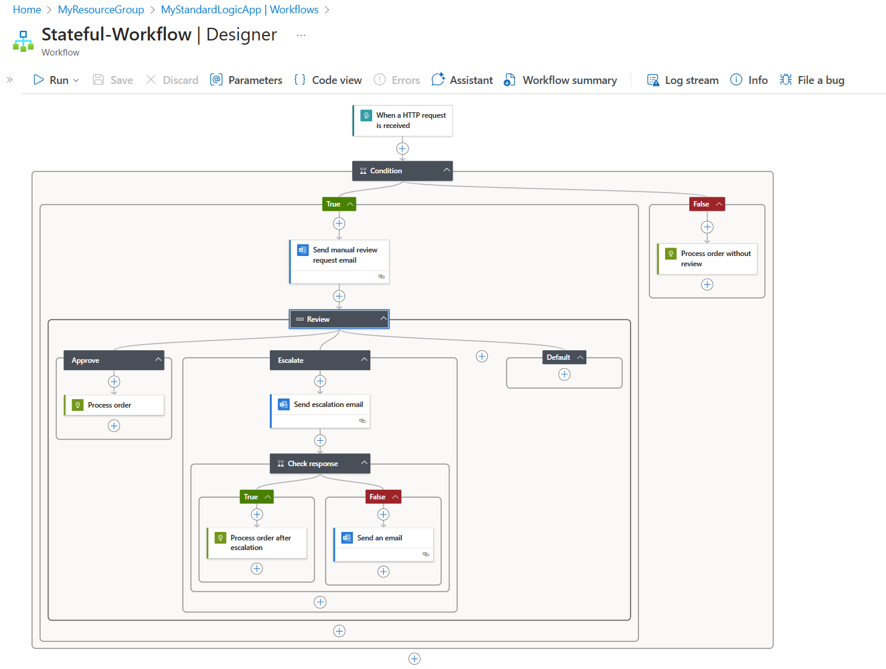</div>
<p class="shot-cap">Example enterprise workflow from Microsoft Learn — HTTP, conditions, connectors. You do not need to open another site to see this.</p>

**Send email action (what a box looks like when you open it).**

<div class="shot-wrap">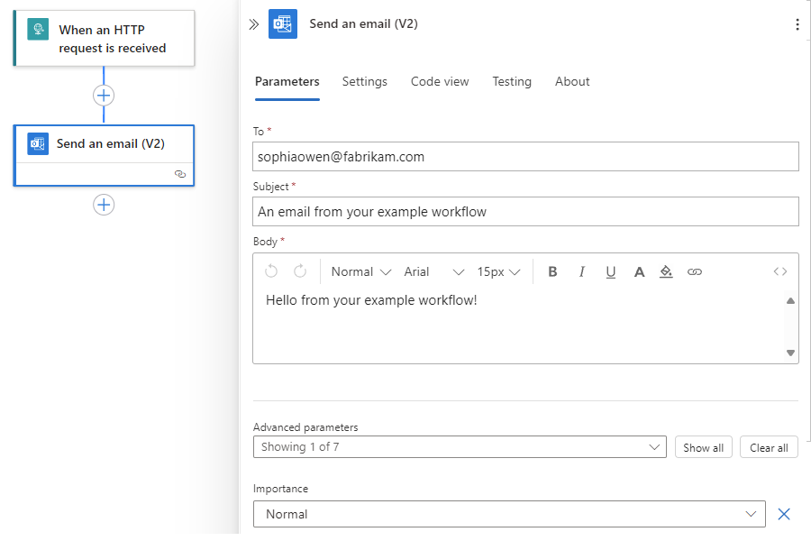</div>
<p class="shot-cap">Send an email action: To, Subject, Body. No C# method. That is Logic Apps.</p>

| | Function App | Logic App |
|---|---|---|
| What you write | C# (or JS) | Designer boxes, optional expressions |
| Trigger | HTTP, queue, timer, blob | Same plus 1,000+ connectors |
| Long human approval | Bad — timeout | Good — wait action |
| Domain tax rule | Good | Awkward |
| AWS analogue | Lambda | Step Functions |

If the project is AWS, be honest: “We used Lambda and Step Functions. Same split: **code vs orchestration**.” Do not fake Azure.

#### Watch-outs

- Do not say they are the same thing with a different name.
- Long human approval fits Logic Apps / Step Functions better than a long Function.
- Do not claim you used Logic Apps if the stack was only AWS. Name the analogue and stop.

---

### Q. Why deploy Angular in S3? Documents to S3?

> **Say:** Angular is static files after `ng build`. S3 plus CloudFront is cheap and it scales. The API stays on ECS behind ALB.
>
> Those are two different URLs, so we need CORS, and the interceptor still attaches the JWT.
>
> For documents, the browser does not put file bytes in SQL. The API checks auth and returns a pre-signed PUT URL. The browser uploads to S3. SQL stores the key and the metadata.

#### Walk through — Angular on S3

After `ng build` you have files, not a running Node process. You **can** host them on IIS or ECS, but then you pay compute to serve `main.js`. **S3** stores the files. **CloudFront** caches them.

The **API** stays on ECS behind ALB. That **is** compute: JWT, SQL, rules.

Two URLs:

- `https://app.example.com` → CloudFront → S3 (Angular)
- `https://api.example.com` → ALB → ECS

A page from `app` calling `api` is **cross-origin**. API must send CORS for that Angular origin. The interceptor still attaches JWT. Cookie from `app` is not auto-sent to `api`. This means SPA + split host almost always uses **Bearer** + interceptor.

<div class="mc-row" markdown="1">
<div class="mc-col mc-bad" markdown="1">
<span class="mc-lbl">Before — Angular on the same IIS box as the API</span>

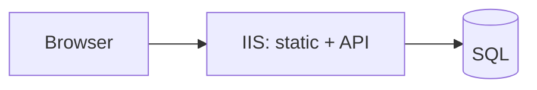
```mermaid
flowchart LR
  U["Browser"] --> IIS["IIS: static + API"]
  IIS --> SQL[("SQL")]
```

</div>
<div class="mc-col mc-good" markdown="1">
<span class="mc-lbl">After — static on S3, API on ECS</span>

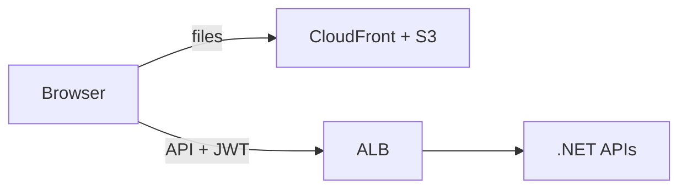
```mermaid
flowchart LR
  U["Browser"] -->|"files"| CF["CloudFront + S3"]
  U -->|"API + JWT"| ALB["ALB"]
  ALB --> API[".NET APIs"]
```

</div>
</div>

#### Walk through — documents (pre-signed URL)

Do not `POST` a 20 MB PDF through the .NET API into a `varbinary` column. That uses API memory and fills the database.

Let us see the steps:

1. Browser: file name, type, size, JWT. `POST` to **Files API**. **No file bytes yet.**
2. Files API checks the user. Asks S3 for a **pre-signed PUT** — a short-lived link for **one** key.
3. API returns `{ url, key }`.
4. Browser `PUT`s the bytes **straight to S3**. The API never holds the file.
5. Browser calls **confirm**. API writes SQL: who, when, type, size, **S3 key**. SQL never stores the blob.

Download later: API checks auth, returns a **pre-signed GET**.

<div class="mc-row" markdown="1">
<div class="mc-col mc-bad" markdown="1">
<span class="mc-lbl">Before — bytes through the API into SQL</span>

```csharp
[HttpPost]
public async Task<IActionResult> Upload(IFormFile file) {
  using var ms = new MemoryStream();
  await file.CopyToAsync(ms);
  db.Documents.Add(new Document { Bytes = ms.ToArray() });
  await db.SaveChangesAsync();   // blob in SQL
  return Ok();
}
```

</div>
<div class="mc-col mc-good" markdown="1">
<span class="mc-lbl">After — pre-signed PUT, SQL stores the key</span>

```csharp
[HttpPost("start")]
public async Task<IActionResult> Start(Meta m) {
  var key = $"docs/{user}/{Guid.NewGuid()}";
  var url = _s3.GetPreSignedUrl(key, "PUT");
  return Ok(new { url, key });
}
[HttpPost("confirm")]
public async Task Confirm(string key) {
  db.Documents.Add(new Document { S3Key = key, Size = ... });
  await db.SaveChangesAsync();
}
```

</div>
</div>

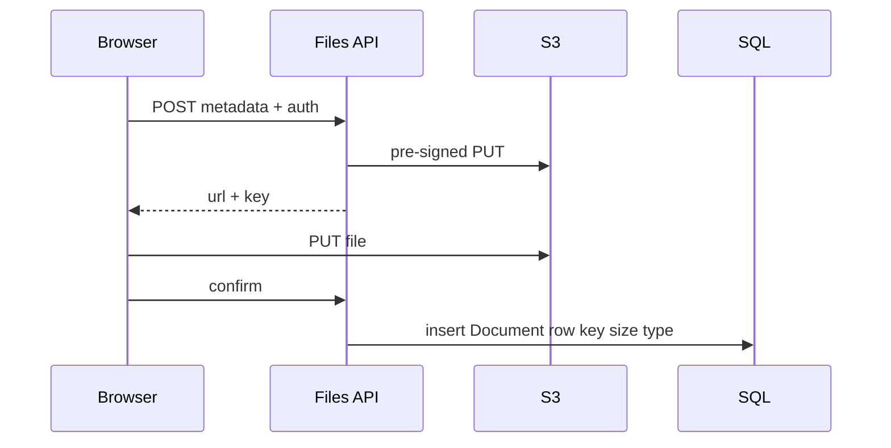
```mermaid
sequenceDiagram
  participant U as Browser
  participant API as Files API
  participant S3 as S3
  participant DB as SQL
  U->>API: POST metadata + auth
  API->>S3: pre-signed PUT
  API-->>U: url + key
  U->>S3: PUT file
  U->>API: confirm
  API->>DB: insert Document row key size type
```

#### Watch-outs

- Public bucket + guessable URL is not “we used S3.” Private bucket + pre-signed URLs.
- Confirm matters. Otherwise SQL thinks a file exists when the user cancelled the PUT.

---

## 4. Angular

### Q. Pass data: component, module to module (users → facility), hide on the URL

> **Say:** There are four ways.
>
> Parent to child is `@Input`. Child to parent is `@Output` plus `EventEmitter`. Users module to facility module is a root service with a `BehaviorSubject`. That is because they are not parent and child.
>
> For the URL I put only the id, like `/orders/42`. I do not put a token or a full object on the query string.

#### Walk through

| # | Name | Angular | Direction |
|---|---|---|---|
| 1 | Properties / fields | `@Input` | Parent → child |
| 2 | Emitter | `@Output` + `EventEmitter` | Child → parent |
| 3 | RxJS | root service + `BehaviorSubject` | Any screen, **including users → facility** |
| 4 | Route | `/orders/42` or `router.state` | This page → next page. **Id only** |

First, why four ways? Parent template exists only when one component **hosts** another. That is 1 and 2. Different lazy modules — no parent template. That is 3. URL changes — that is 4.

**1. Properties (`@Input`).** Parent owns the row. Parent writes `[user]="row"`. Child declares `@Input() user`. Child reads `this.user` / `{{ user.name }}`. Child does not HTTP that row again.

<div class="mc-row" markdown="1">
<div class="mc-col mc-bad" markdown="1">
<span class="mc-lbl">Before — child fetches its own row</span>

```ts
export class UserEditorComponent {
  user!: User;
  constructor(private api: UserApi) {}
  ngOnInit() {
    this.api.get(this.route.snapshot.params['id'])
      .subscribe(u => this.user = u);
  }
}
```

```html
<user-editor></user-editor>
```

</div>
<div class="mc-col mc-good" markdown="1">
<span class="mc-lbl">After — parent passes; child uses @Input</span>

```ts
export class UserEditorComponent {
  @Input() user!: User;
  ngOnInit() { console.log(this.user.name); }
}
```

```html
<h3>{{ user.name }}</h3>
<user-editor [user]="row" (saved)="reload()"></user-editor>
```

</div>
</div>

**2. Emitter (`@Output`).** Child cannot call `parent.reload()`. Child raises `saved.emit(user)`. Parent: `(saved)="reload()"`.

<div class="mc-row" markdown="1">
<div class="mc-col mc-bad" markdown="1">
<span class="mc-lbl">Before — child injects the parent</span>

```ts
constructor(private parent: UserListComponent) {}
save() { this.parent.reload(); }  // glued
```

</div>
<div class="mc-col mc-good" markdown="1">
<span class="mc-lbl">After — child emits</span>

```ts
@Output() saved = new EventEmitter<User>();
save() { this.saved.emit(this.user); }

// How they call it — parent template
<user-editor (saved)="reload()"></user-editor>
```

</div>
</div>

**3. Users module → facility module.** Modules should not import each other. Put a **root** service with a `BehaviorSubject`.

**Purpose.** A `BehaviorSubject` holds **one current value**. When a screen subscribes **late**, it still gets that last value. A plain `Subject` does not remember. The late screen would be empty.

**Use.** Users module calls `set(id)`. Facility module subscribes to `id$`. They do not import each other. They both inject `SelectionStore`.

Let us understand this with an example. The user clicks a row. The id is `42`. Then the facility screen loads. That screen was not listening when we called `set(42)`. `BehaviorSubject` still gives it `42`. That is why we use it here.

<div class="mc-row" markdown="1">
<div class="mc-col mc-bad" markdown="1">
<span class="mc-lbl">Before — copy the user through the URL</span>

```ts
this.router.navigate(['/facility'], {
  queryParams: { user: JSON.stringify(user) }
});
```

</div>
<div class="mc-col mc-good" markdown="1">
<span class="mc-lbl">After — one store, any screen</span>

```ts
@Injectable({ providedIn: 'root' })
export class SelectionStore {
  private readonly _id = new BehaviorSubject<number | null>(null);
  readonly id$ = this._id.asObservable();
  set(id: number) { this._id.next(id); }
}

// How they call it
this.store.set(user.id);          // users module
this.store.id$.subscribe(...);    // facility module
```

</div>
</div>

**4. Hide data on the URL.** The address bar is public. Put **`/orders/42`**. The payload stays in the store. Never `?token=` or `?ssn=`. `router.state` is extra. A refresh can lose it. The **id** on the route is the source of truth.

<div class="mc-row" markdown="1">
<div class="mc-col mc-bad" markdown="1">
<span class="mc-lbl">Before — secrets in the URL</span>

```ts
this.router.navigate(['/edit'], {
  queryParams: { token: jwt, ssn: user.ssn }
});
```

</div>
<div class="mc-col mc-good" markdown="1">
<span class="mc-lbl">After — id in the route</span>

```ts
this.router.navigate(['/orders', order.id]);
// URL: /orders/42
```

</div>
</div>

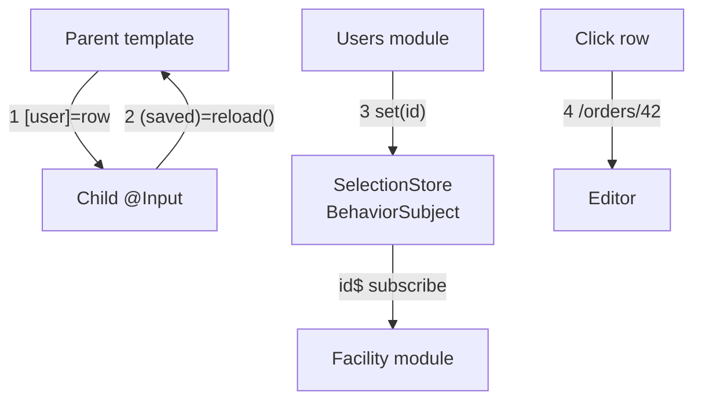
```mermaid
flowchart TD
  P["Parent template"] -->|"1 [user]=row"| C["Child @Input"]
  C -->|"2 (saved)=reload()"| P
  U["Users module"] -->|"3 set(id)"| ST["SelectionStore<br/>BehaviorSubject"]
  ST -->|"id$ subscribe"| F["Facility module"]
  N["Click row"] -->|"4 /orders/42"| E["Editor"]
```

#### Watch-outs

- Injecting `UserListComponent` into the child glues them forever.
- Her users → facility example is **3**, not `@Input`.

---

### Q. Parallel APIs, then customize the result. Observables vs Promise

> **Say:** When the calls do not depend on each other, I start them together with `forkJoin`. When all return, I `map` to the view model.
>
> An **Observable** is a stream. I can cancel and retry. A **Promise** is one value. I cannot really cancel it. Angular `HttpClient` is an Observable, so I keep it unless a third-party API returns a Promise.

#### Walk through

If you wait for user, then orders, then facilities, the user waits for the **sum** of three times. If they do not depend on each other, start all three **at once**. `forkJoin` waits until **all** complete, then you **map** to the view model.

If one fails, `forkJoin` errors unless you handle that call.

| | Observable | Promise |
|---|---|---|
| Values | Zero, one, or many over time | Exactly one (or reject) |
| Cancel | `unsubscribe` | Not really |
| Retry | `retry(1)` | You write a loop |
| Angular HTTP | Default | Old `.toPromise()` |

Keep Observables for `HttpClient` so interceptors, `switchMap`, and `retry` still work.

<div class="mc-row" markdown="1">
<div class="mc-col mc-bad" markdown="1">
<span class="mc-lbl">Before — wait one after another</span>

```ts
this.api.getUser(id).subscribe(u => {
  this.api.getOrders(id).subscribe(o => {
    this.api.getFacilities().subscribe(f => {
      this.vm = { ...u, orders: o, facilities: f };
    });
  });
});
```

</div>
<div class="mc-col mc-good" markdown="1">
<span class="mc-lbl">After — forkJoin then map</span>

```ts
forkJoin({
  user: this.api.getUser(id),
  orders: this.api.getOrders(id),
  facilities: this.api.getFacilities(),
}).subscribe(x => this.vm = { ...x.user, orders: x.orders });
```

</div>
</div>

```mermaid
flowchart LR
  A["getUser()"] --> J["forkJoin"]
  B["getOrders()"] --> J
  C["getFacilities()"] --> J
  J --> M["map to view model"]
  M --> V["component"]
```

#### Watch-outs

- Nested `subscribe` inside `subscribe` is what she does not want. Use `forkJoin` / `switchMap`.
- `combineLatest` is for streams that keep ticking. `forkJoin` is for three HTTP calls, one shot each.

---

### Q. API integration: service class vs component. Interceptor

> **Say:** The component is the UI. The service is `HttpClient` plus mapping. That is the API-client pattern.
>
> The interceptor is registered once with `HTTP_INTERCEPTORS`. I do not call it. `HttpClient` does. Typical interceptors attach the JWT, retry 401 once, and add a correlation id.

#### Walk through

If every component calls `http.get('/api/users')`, you copy URLs twenty times. **Service** owns the URL and returns typed data. **Component** binds the screen and calls `this.userService.get(id)`.

That split **is** the pattern she asked: service class vs component class.

**Interceptor.** A class in the `HttpClient` pipeline. You register it once. You never `new AuthInterceptor()` from a component. Use it for things true of **all** calls (Bearer token). One screen’s extra header belongs in the service.

<div class="mc-row" markdown="1">
<div class="mc-col mc-bad" markdown="1">
<span class="mc-lbl">Before — HTTP inside the component</span>

```ts
export class UserListComponent {
  constructor(private http: HttpClient) {}
  ngOnInit() {
    this.http.get('/api/users').subscribe(...);
  }
}
```

</div>
<div class="mc-col mc-good" markdown="1">
<span class="mc-lbl">After — service + interceptor</span>

```ts
@Injectable({ providedIn: 'root' })
export class UserService {
  constructor(private http: HttpClient) {}
  get(id: number) { return this.http.get<User>(`/api/users/${id}`); }
}
// interceptor registered once
{ provide: HTTP_INTERCEPTORS, useClass: AuthInterceptor, multi: true }

// How they call it
this.userService.get(id).subscribe(...);
```

</div>
</div>

```mermaid
flowchart LR
  CMP["Component"] --> SVC["UserService"]
  SVC --> HTTP["HttpClient"]
  HTTP --> INT["Auth interceptor"]
  INT --> API["Web API"]
```

#### Watch-outs

- Two interceptors: **order matters**.
- Interceptor cannot see `@Input`. It only sees the HTTP request.

---

### Q. View Encapsulation, RouterOutlet, Subject vs BehaviorSubject (follow-ups)

> **Say:** View Encapsulation default is Emulated. Angular adds attributes so styles stay in that component. ShadowDom is a real shadow tree. None means styles leak. I rarely use None.
>
> `RouterOutlet` is the hole where the routed page appears. The nav bar stays.
>
> A **BehaviorSubject** holds the last value. I use it to share a selected id between modules. Users calls `set(id)`. Facility subscribes later and still gets that id. A plain **Subject** is fire and forget. Good for a toast. Bad for “currently selected user.”

#### Walk through

**View Encapsulation.** CSS in a component should not restyle the whole app.

- **Emulated** (default): Angular adds attributes. CSS mostly stays in that template.
- **ShadowDom:** real shadow DOM. Strong isolation. Some global CSS fights it.
- **None:** CSS is global. Use only when you mean it.

**RouterOutlet.** The router does not replace the whole `AppComponent`. It puts the current page **into** `<router-outlet>`. Nav bar stays.

**Subject vs BehaviorSubject.**

First, why two types? Both can send a value with `next()`. The difference is **memory**.

Let us understand this with an example. Users module sets id `42`. Then Facility module opens and subscribes.

1. **Purpose of BehaviorSubject.** It stores the **current** value. A late subscriber still gets `42`. That is the selected user id.
2. **How we use it.** Put it in a root service. Hide the subject. Expose `id$` with `asObservable()`. Call `set()` to push. Subscribe on the other screen.
3. **Subject.** If you `next(42)` before anyone listens, that `42` is **gone**. Good for a toast. “Show this message once.” The next screen does not need the old toast.

Notice that `new BehaviorSubject(null)` needs a **start value**. `new Subject()` does not.

This means: share state between modules → **BehaviorSubject**. Fire an event and forget → **Subject**.

<div class="mc-row" markdown="1">
<div class="mc-col mc-bad" markdown="1">
<span class="mc-lbl">Before — Subject for selected id</span>

```ts
private readonly _id = new Subject<number>();
readonly id$ = this._id.asObservable();
set(id: number) { this._id.next(id); }

// Facility loads later — missed the next(). Empty screen.
```

</div>
<div class="mc-col mc-good" markdown="1">
<span class="mc-lbl">After — BehaviorSubject remembers the last id</span>

```ts
private readonly _id = new BehaviorSubject<number | null>(null);
readonly id$ = this._id.asObservable();
set(id: number) { this._id.next(id); }

// How they call it
this.store.set(42);               // users module
this.store.id$.subscribe(id => {  // facility — still gets 42
});
```

</div>
</div>

#### Watch-outs

- Subject for “currently selected user” — the late screen is empty. Use BehaviorSubject.
- Encapsulation None plus `.btn` will fight Bootstrap. Default Emulated unless you had a reason.

---

## 5. SQL, deadlock, whiteboard schemas

### Q. SQL transaction — COMMIT and ROLLBACK (same idea in C#)

> **Say:** In one database we wrap the work in a transaction. If every step succeeds, we **COMMIT**. If any step fails, we **ROLLBACK**. Then none of the changes stay.
>
> In C# that is the same idea. We begin a transaction. We save the order and the lines. Then we **Commit**. In **catch** we **Rollback**.

#### Walk through

First, why a transaction? We subtract stock. We insert `Order`. We insert `OrderLine`. Either **all three** succeed, or **none**.

Let us understand this with an example. Stock is 1. Two statements without a transaction: the `INSERT` into Order succeeds. The stock `UPDATE` fails. Now we have an order and no stock change. That is the pain.

Notice that `COMMIT` means “keep it.” `ROLLBACK` means “undo everything in this transaction.”

This means: SQL `BEGIN TRAN` … `COMMIT` / `ROLLBACK` is the same idea as C# `BeginTransaction` … `CommitAsync` / `RollbackAsync`.

**Before — no transaction.** Order can save. Stock can fail. They drift.

<div class="mc-row" markdown="1">
<div class="mc-col mc-bad" markdown="1">
<span class="mc-lbl">SQL — two statements, auto-commit</span>

```sql
INSERT INTO dbo.[Order] (CustomerId, Total)
VALUES (@customerId, @total);
-- this is already saved

UPDATE dbo.Inventory
SET    QtyOnHand = QtyOnHand - @qty
WHERE  ProductId = @productId
  AND  QtyOnHand >= @qty;
-- if this fails, the order is still there
```

</div>
<div class="mc-col mc-bad" markdown="1">
<span class="mc-lbl">C# — two SaveChanges, two commits</span>

```csharp
_db.Orders.Add(order);
await _db.SaveChangesAsync();   // committed

_db.Inventory.Attach(inv);
inv.QtyOnHand -= qty;
await _db.SaveChangesAsync();   // if this throws,
                                // order is already in SQL
```

</div>
</div>

**After — one transaction.** COMMIT keeps all. ROLLBACK undoes all.

<div class="mc-row" markdown="1">
<div class="mc-col mc-good" markdown="1">
<span class="mc-lbl">SQL — BEGIN TRAN, COMMIT or ROLLBACK</span>

```sql
BEGIN TRANSACTION;

UPDATE dbo.Inventory
SET    QtyOnHand = QtyOnHand - @qty
WHERE  ProductId = @productId
  AND  QtyOnHand >= @qty;

IF @@ROWCOUNT = 0
BEGIN
    ROLLBACK TRANSACTION;
    THROW 50001, 'Out of stock', 1;
END

INSERT INTO dbo.[Order] (CustomerId, Status, Total)
VALUES (@customerId, 'Placed', @total);

SET @orderId = SCOPE_IDENTITY();

INSERT INTO dbo.OrderLine
    (OrderId, LineNo, ProductId, Qty, UnitPrice)
VALUES
    (@orderId, 1, @productId, @qty, @price);

COMMIT TRANSACTION;
```

</div>
<div class="mc-col mc-good" markdown="1">
<span class="mc-lbl">C# — BeginTransaction, Commit or Rollback</span>

```csharp
await using var tx =
    await _db.Database.BeginTransactionAsync();
try
{
    var rows = await _db.Database.ExecuteSqlInterpolatedAsync(
        $@"UPDATE dbo.Inventory
           SET QtyOnHand = QtyOnHand - {qty}
           WHERE ProductId = {productId}
             AND QtyOnHand >= {qty}");
    if (rows == 0)
        throw new InvalidOperationException("Out of stock");

    _uow.Orders.Add(order);
    _uow.Lines.Add(line);
    await _uow.SaveChangesAsync();

    await tx.CommitAsync();
}
catch
{
    await tx.RollbackAsync();
    throw;
}
```

</div>
</div>

**How they call it**

| | SQL | C# |
|---|---|---|
| Start | `BEGIN TRANSACTION` | `BeginTransactionAsync()` |
| Keep | `COMMIT TRANSACTION` | `CommitAsync()` |
| Undo | `ROLLBACK TRANSACTION` | `RollbackAsync()` |
| Fail check | `IF @@ROWCOUNT = 0` then rollback | `if (rows == 0)` throw, then catch rollback |

`SaveChangesAsync` already uses a transaction for the **tracked** rows. We still begin an **outer** transaction when we mix raw `UPDATE` stock and EF inserts. Then they commit together.

Two microservices cannot share this. That is a **saga**, not `BEGIN TRAN` across Order DB and Payment DB.

#### Watch-outs

- Do not wait for a user click inside `BEGIN TRAN`. The lock stays until COMMIT or ROLLBACK.
- After `ROLLBACK`, those inserts are gone. Retry the **whole** place-order.

---

### Q. Deadlock — prevent, and what after it happens

> **Say:** A deadlock happens when two connections lock rows in opposite order. SQL Server picks a victim, rolls it back, and returns error 1205.
>
> To prevent it, we always lock tables in the same order. We keep transactions short. We do not wait for a user click inside a transaction.
>
> After it happens, we catch 1205 and retry the whole unit of work a few times. We do not retry only one UPDATE after a half-written business step.

#### Walk through

First, why does deadlock happen? Two connections lock rows in **opposite order**. Nobody can move.

A lock means “I am changing this row; you wait.” Deadlock means two waiters each hold what the other needs. SQL Server **kills one** (the victim), error **1205**, so the other can finish.

Let us see the classic picture. Connection A updates Orders, then waits on Inventory. Connection B updates Inventory, then waits on Orders. Same two rows, **opposite order**.

**Prevent:**

1. Always touch tables in the **same order** (Orders then Inventory, everywhere).
2. Keep the transaction **short**. Do not wait for a user click inside `BEGIN TRAN`.
3. Readers can use snapshot / RCSI so they do not take long shared locks.

**After:** the victim’s work is **gone**. The app retries the **whole** place-order, not “step 2 only.” A few retries, then show failure. Log 1205.

<div class="mc-row" markdown="1">
<div class="mc-col mc-bad" markdown="1">
<span class="mc-lbl">Before — opposite lock order</span>

```mermaid
flowchart TD
  A["Txn A locks Orders"] --> A2["waits Inventory"]
  B["Txn B locks Inventory"] --> B2["waits Orders"]
  A2 --> X["Deadlock 1205"]
  B2 --> X
```

```sql
-- Session A
UPDATE dbo.Orders SET Status='Paid' WHERE Id=1;
UPDATE dbo.Inventory SET Qty = Qty-1 WHERE ProductId=9;

-- Session B  (opposite order)
UPDATE dbo.Inventory SET Qty = Qty-1 WHERE ProductId=9;
UPDATE dbo.Orders SET Status='Paid' WHERE Id=1;
```

</div>
<div class="mc-col mc-good" markdown="1">
<span class="mc-lbl">After — same lock order + retry the unit of work</span>

```mermaid
flowchart TD
  A["Txn A: Orders then Inventory"] --> OK["Both finish"]
  B["Txn B: Orders then Inventory"] --> WAIT["B waits, then runs"]
```

```sql
-- Both sessions, same order
UPDATE dbo.Orders SET Status='Paid' WHERE Id=1;
UPDATE dbo.Inventory SET Qty = Qty-1 WHERE ProductId=9;

-- After 1205: retry the whole PlaceOrder, not one UPDATE
```

</div>
</div>

#### Watch-outs

- “We disable lock escalation” is not a deadlock strategy.
- Retrying one `UPDATE` after a partial business step can double-charge. Retry the **unit of work**.

---

### Q. Temp table inside a stored procedure

> **Say:** A temp table `#Temp` belongs to this connection. It lives in tempdb. It can have indexes. I use it as a working set inside a large stored procedure. First I stage the keys. Then I join.
>
> A table variable has no statistics. A CTE is only a named query. It is not storage. I use a temp table when I need to reuse an intermediate result.

#### Walk through

First, why a temp table? A big stored procedure often needs “first find 10,000 keys, then join to five tables.” One giant SELECT makes a hard plan.

A **temp table** (`#T`) lets you:

1. Insert the keys.
2. Index `#T` if needed.
3. Join `#T` to the real tables more than once.

It belongs to **this connection**. Another user has a different `#T`. It lives in **tempdb**.

**Table variable** (`@T`): lighter, but the optimizer often assumes one row. Bad for large sets.

**CTE:** a name for a subquery. Not a stored copy. Use CTE for clarity. Use `#temp` when you **reuse** a result and want statistics.

<div class="mc-row" markdown="1">
<div class="mc-col mc-alt" markdown="1">
<span class="mc-lbl">CTE — named query, not stored</span>

```sql
WITH keys AS (
  SELECT OrderId FROM dbo.[Order] WHERE Status = 'Open'
)
SELECT * FROM keys k
JOIN dbo.OrderLine ol ON ol.OrderId = k.OrderId;
```

</div>
<div class="mc-col mc-good" markdown="1">
<span class="mc-lbl">#temp — working set you can index and reuse</span>

```sql
CREATE TABLE #keys (OrderId int PRIMARY KEY);
INSERT INTO #keys (OrderId)
SELECT OrderId FROM dbo.[Order] WHERE Status = 'Open';

SELECT * FROM #keys k
JOIN dbo.OrderLine ol ON ol.OrderId = k.OrderId;
-- How they call it: EXEC dbo.usp_OpenOrderReport;
```

</div>
</div>

#### Watch-outs

- Temp tables are not always faster. For 20 rows, a CTE is enough.
- Do not use `#temp` as an excuse for a 2,000-line SP you never measured.

---

### Q. Schema: OrderSummary when the user buys directly (no cart). Order history SELECT. Stock when many people buy

> **Say:** When the user buys directly, there is still Order, OrderLine, and Product. There is no Cart table.
>
> For stock I do not SELECT qty and then hope. I update in one statement: subtract qty only where qty is still enough. If `@@ROWCOUNT` is 0, I reject. Two buyers serialize on that row. They do not oversell.

#### Walk through — tables

“Buy now” still needs a **header** (who, when, status, total) and **lines** (product, qty, price). Product is the catalog. Inventory is qty on hand. No Cart table — nothing sits overnight in a basket. The **order** shape is the same as checkout.

```mermaid
erDiagram
  CUSTOMER ||--o{ ORDER : places
  ORDER ||--|{ ORDER_LINE : contains
  PRODUCT ||--o{ ORDER_LINE : "sold as"
  PRODUCT ||--|| INVENTORY : stocks
  CUSTOMER {
    int CustomerId PK
    string Email
  }
  ORDER {
    int OrderId PK
    int CustomerId FK
    datetime CreatedUtc
    string Status
    money Total
  }
  ORDER_LINE {
    int OrderId PK
    int LineNo PK
    int ProductId FK
    int Qty
    money UnitPrice
  }
  PRODUCT {
    int ProductId PK
    string Sku
    string Name
  }
  INVENTORY {
    int ProductId PK
    int QtyOnHand
    int RowVersion
  }
```

**Order history** — join, newest first, one customer:

```sql
SELECT o.OrderId, o.CreatedUtc, o.Status, o.Total,
       p.Name, ol.Qty, ol.UnitPrice
FROM dbo.[Order] o
JOIN dbo.OrderLine ol ON ol.OrderId = o.OrderId
JOIN dbo.Product p ON p.ProductId = ol.ProductId
WHERE o.CustomerId = @customerId
ORDER BY o.CreatedUtc DESC;
```

#### Walk through — two people, one item in stock

Wrong: both read `Qty = 1`, both think they can buy, both write `Qty = 0`. You sold two.

Right: **one statement** that succeeds only if stock is enough. SQL locks that row. The second buyer gets `ROWCOUNT = 0`.

<div class="mc-row" markdown="1">
<div class="mc-col mc-bad" markdown="1">
<span class="mc-lbl">Before — read then hope</span>

```sql
-- both buyers read Qty = 1
SELECT QtyOnHand FROM dbo.Inventory WHERE ProductId = @id;
-- both write Qty = 0  → sold two
UPDATE dbo.Inventory SET QtyOnHand = 0 WHERE ProductId = @id;
```

</div>
<div class="mc-col mc-good" markdown="1">
<span class="mc-lbl">After — one UPDATE that can fail</span>

```sql
UPDATE dbo.Inventory
SET    QtyOnHand = QtyOnHand - @qty
WHERE  ProductId = @productId
  AND  QtyOnHand >= @qty;

IF @@ROWCOUNT = 0
    THROW 50001, 'Out of stock', 1;
```

</div>
</div>

```mermaid
flowchart TD
  BUY["Two buyers same SKU"] --> UPD["One UPDATE Qty-1 WHERE Qty>=1"]
  UPD --> OK{"ROWCOUNT?"}
  OK -->|1| SOLD["Sold"]
  OK -->|0| NO["Out of stock"]
```

#### Watch-outs

- Do not check stock in Angular. The second browser does not know about the first.
- `RowVersion` helps if EF does read-change-write. The second writer gets a concurrency exception.

---

### Q. Ads for new vs existing users — schema and query

> **Say:** I store events, like browse and purchase. I do not store only a hard-coded “new” flag. New means no purchases, or first N days. Existing means the user has orders.
>
> Ads target segments. The query picks ads whose segment matches the user, orders by recent events, and excludes ads already clicked.

#### Walk through

She wants a **whiteboard schema**, not “we use AI.”

- **Users** — who they are.
- **Orders** — if a row exists, they are **existing** buyers.
- **User_event** — browsed product X, clicked ad Y.
- **Ad** — title, and which **segment** (`new` vs `existing`).

**New user:** no orders. Welcome ads.  
**Existing:** has orders. Buy-again ads.

Compute segment in the query (`EXISTS` on Orders). Do not store `IsNew` on the user row. That flag goes stale.

```mermaid
erDiagram
  USERS ||--o{ USER_EVENT : generates
  USERS ||--o{ ORDERS : placed
  USER_EVENT }o--|| PRODUCT : about
  AD ||--o{ AD_TARGET : targets
  SEGMENT ||--o{ AD_TARGET : matches
  USERS {
    int UserId PK
    datetime FirstSeenUtc
  }
  USER_EVENT {
    int EventId PK
    int UserId FK
    string Kind
    int ProductId
    datetime AtUtc
  }
  AD {
    int AdId PK
    string Title
    string SegmentCode
  }
```

```sql
WITH seg AS (
  SELECT u.UserId,
         CASE WHEN EXISTS (
           SELECT 1 FROM dbo.Orders o WHERE o.UserId = u.UserId
         ) THEN 'existing' ELSE 'new' END AS SegmentCode
  FROM dbo.Users u
  WHERE u.UserId = @userId
)
SELECT TOP (5) a.AdId, a.Title
FROM seg s
JOIN dbo.Ad a ON a.SegmentCode = s.SegmentCode
ORDER BY a.Priority;
```

#### Watch-outs

- One `Users.IsNew` bit that nobody updates is a weak design.
- The segment query is the **minimum** she needs on the board.

---

### Q. File-upload documents — tables + S3 key, not the blob

> **Say:** SQL stores who uploaded, when, the file name, type, size, S3 key, and status. The file bytes stay in S3.
>
> The table is an index card. The bucket is the cupboard. We do not put the PDF inside SQL.

#### Walk through

First, why two stores? A PDF is big. SQL is good at **finding a row**. S3 is good at **holding a file**. If we put the bytes in SQL as `VARBINARY(MAX)`, the database grows fast. Backups get slow. The API holds the whole file in memory.

Let us understand this with an example. Ravi uploads `invoice.pdf`.

1. **SQL** stores the card: who, file name, size, type, **S3 key**, status, time.
2. **S3** stores the bytes. The key is the path, like `docs/42/a1b2.pdf`.
3. **Download later.** The API checks that this user may see the file. Then it makes a **pre-signed GET** URL. The browser downloads from S3. SQL never sends the blob.

Notice that `S3Key` is how we find the object. File name alone is not enough. Two users can both upload `invoice.pdf`.

This means: metadata in SQL. File in S3. Never `VARBINARY(MAX)` for the PDF when S3 is in the design.

**Tables to draw**

| Table | Job |
|---|---|
| `USERS` | Who uploaded |
| `DOCUMENT_TYPE` | Invoice, ID, report |
| `DOCUMENT` | The index card |

Draw these columns on `DOCUMENT`: `UserId`, `TypeId`, `FileName`, `ContentType`, `ByteLength`, `S3Bucket`, `S3Key`, `Status`, `UploadedUtc`.

One user can upload many documents. One type can classify many documents.

```mermaid
erDiagram
  USERS ||--o{ DOCUMENT : uploads
  DOCUMENT_TYPE ||--o{ DOCUMENT : classifies
  DOCUMENT {
    int DocumentId PK
    int UserId FK
    int TypeId FK
    string FileName
    string ContentType
    int ByteLength
    string S3Bucket
    string S3Key
    string Status
    datetime UploadedUtc
  }
```

**How they call it**

1. Browser sends file name and size. Not the bytes yet.
2. API returns a pre-signed **PUT** URL and a key.
3. Browser uploads to S3.
4. Browser calls confirm. API inserts the `DOCUMENT` row.
5. Later, API returns a pre-signed **GET**. Browser downloads from S3.

#### Watch-outs

- Filename without the key — you cannot find the object.
- Public S3 URL in the table — skip auth on download. Use pre-signed GET.

---

## 6. Netflix-style streaming (odd follow-up)

### Q. How would you implement data streaming like Netflix?

> **Say:** Netflix does not send the whole movie as one file. We use **HLS** or **DASH**. The movie is cut into small **chunks**. A playlist (`.m3u8`) tells the player which chunk to ask for next. The player downloads chunks over **HTTP**, usually from a **CDN** like CloudFront. If the network gets slow, the player asks for a **smaller** quality. That is adaptive bitrate. The files sit in **S3**.
>
> If they mean progress in my app, I use SignalR. That is not the movie. I only go deep if I actually built a player.

#### Walk through

First, why not one file? A two-hour movie is huge. If the network drops in the last minute, the user waits again. So we cut the movie into small pieces.

**Memory trick:** HLS = playlist + small chunks + HTTP + adaptive quality + CDN.

**HLS** means HTTP Live Streaming. **DASH** means Dynamic Adaptive Streaming over HTTP. Same idea. Both use **HTTP**, like a REST API. They are **not** a WebSocket.

First, pick the **kind** of communication. Three jobs. Three tools.

```mermaid
flowchart TB
  COMM["COMMUNICATION"]
  COMM --> API["1. API calls"]
  COMM --> RT["2. Real-time"]
  COMM --> VID["3. Video"]

  API --> REST["REST / gRPC"]
  REST --> RESTP["Purpose: get order, save user<br/>Who talks: client asks, server answers<br/>Connection: short HTTP. Then it closes<br/>Two-way? No. One question, one answer"]

  RT --> WS["WebSocket / SignalR"]
  WS --> WSP["Purpose: progress, chat, live status<br/>Who talks: both sides, any time<br/>Connection: stays open. Constant pipe<br/>Two-way? Yes"]

  VID --> HLS["HLS — HTTP Live Streaming"]
  VID --> DASH["DASH — Dynamic Adaptive Streaming over HTTP"]
  HLS --> VP["Purpose: play a movie in small chunks<br/>Who talks: player asks, CDN sends the file<br/>Connection: many small HTTP GETs. Not one pipe<br/>Two-way? No. Player pulls. Server does not chat"]
  DASH --> VP
```

**When to use what**

| I need | Use | Why |
|---|---|---|
| Load orders, save a form | **REST / gRPC** | One request. One response. Then close. |
| “Upload is 72%”, a toast, live board | **WebSocket / SignalR** | Server must **push**. Connection stays open. **Two-way.** |
| Netflix-style movie | **HLS** or **DASH** | Playlist + chunks + adaptive quality. Still **HTTP**. CDN can cache. |
| Do **not** use | WebSocket for the whole film | Wrong tool. No playlist. No adaptive chunks. Hard for a CDN. |

Notice that HLS and DASH sit under **Video**, but the wire is still **HTTP**, same family as REST. WebSocket is a **different** protocol. It stays connected.

This means: constant two-way pipe → WebSocket. Movie → HLS/DASH. Normal API → REST.

**The picture.** Player asks CloudFront. CloudFront asks S3 only if the chunk is not already cached.

```mermaid
flowchart TD
  S3["S3 origin<br/>.m3u8 + video chunks"] --> CF["CloudFront CDN"]
  CF -->|"small chunks"| P["Player"]
```

**1. Cut the movie into chunks.** Each piece is a few seconds. Files are often `.ts` or fragmented MP4.

```
Movie
 ├── chunk 1  →  0–6 seconds
 ├── chunk 2  →  6–12 seconds
 ├── chunk 3  → 12–18 seconds
 └── ...
```

**2. `.m3u8` is the playlist.** It is **not** the movie. It is a list: play `chunk001.ts`, then `chunk002.ts`. For adaptive quality there is a **master** playlist that points to 360p, 720p, and 1080p lists.

```
Master playlist
 ├── 360p playlist
 ├── 720p playlist
 └── 1080p playlist
```

**3. The player asks for one chunk at a time.** It does not download everything first. It keeps a **small buffer** so play does not stop between chunks.

```mermaid
sequenceDiagram
  participant P as Player
  participant CF as CloudFront
  P->>CF: give me chunk 1
  CF-->>P: chunk 1
  P->>CF: give me chunk 2
  CF-->>P: chunk 2
  Note over P: small buffer, then play
```

**4. Adaptive bitrate.** If the network gets slow, the player asks for 480p instead of 1080p. If the network gets better, it goes back up. The video does not have to stop.

Notice that this is still **HTTP GET**. One small request per chunk. It is not one open socket for the whole film.

**Where CloudFront sits.** CloudFront is the **CDN**. Many users watch the same chunk. If each user hits S3, S3 is busy and far away. CloudFront keeps hot chunks close to the user.

<div class="mc-row" markdown="1">
<div class="mc-col mc-bad" markdown="1">
<span class="mc-lbl">Before — every user hits S3</span>

```mermaid
flowchart TD
  S3["S3"] --> A["User A"]
  S3 --> B["User B"]
  S3 --> C["User C"]
```

</div>
<div class="mc-col mc-good" markdown="1">
<span class="mc-lbl">After — CloudFront caches the chunks</span>

```mermaid
flowchart TD
  S3["S3 origin"] --> CF["CloudFront"]
  CF --> A["User A"]
  CF --> B["User B"]
  CF --> C["User C"]
```

</div>
</div>

**HLS vs WebSocket.** They are not the same thing.

<div class="mc-row" markdown="1">
<div class="mc-col mc-alt" markdown="1">
<span class="mc-lbl">HLS / DASH — the movie</span>

```mermaid
flowchart TD
  L["Playlist .m3u8"] --> H["Small HTTP GETs"]
  H --> C["Video chunks"]
  C --> B["Player buffer"]
  B --> PLAY["Playback"]
```

</div>
<div class="mc-col mc-alt" markdown="1">
<span class="mc-lbl">WebSocket / SignalR — status, not the film</span>

```mermaid
flowchart LR
  CL["Client"] <-->|"one open connection"| SV["Server"]
```

Use SignalR for: “processing is 72%”, a toast, live status. Do not say “we streamed the movie on a WebSocket.”

</div>
</div>

This means: movie → HLS + chunks + CDN. Progress bar in **our** app → SignalR. If we never built a player, say so. Chunked download of a report is not Netflix.

#### Watch-outs

- “WebSocket streams the movie” is the wrong picture.
- Do not claim HLS + CloudFront if you only used SignalR or a file download.

---

## 7. Behavioral and AI

### Q. You cannot finish on time. How do you tell your manager?

> **Say:** I tell my manager before the date slips. I give the fact, the impact, and two options. I recommend one. I ask for a decision.
>
> I do not hide until the due day. I do not only say I will try harder with no new date.

#### Walk through

First, why tell early? She is testing communication, not overtime.

1. You **see** the slip. Same day. Not Friday night.
2. Facts: what is done, what is left, what is blocked.
3. Impact: UAT date, another team waiting.
4. Two options **with dates**. You recommend one. Manager picks.

Wrong: silence, then “I need two more days” on the due date. Wrong: “I will work the weekend” with no new date.

```mermaid
flowchart TD
  SEE["I see the slip coming"] --> TELL["Same day: tell manager"]
  TELL --> PACK["Impact + 2 options + new date"]
  PACK --> DEC["Manager decides"]
  DEC --> WORK["Work the new plan"]
  SEE -.->|wrong| HIDE["Surprise on due day"]
```

**Script:** “The inventory API is blocked on a vendor key. If we stay on Friday we will miss UAT. Option A: drop the extra grid, still Friday. Option B: keep the grid, move to Tuesday. I recommend A. Which do you want?”

#### Watch-outs

- Do not blame a teammate in the first sentence. Facts first.
- Options with no dates are not options.

---

### Q. Teammate refuses your review comments. Do you still approve? Your PR was rejected

> **Say:** I split blocker versus nit. Security, data loss, wrong isolation — I do not approve. Naming and style — I comment, and I can still approve.
>
> I escalate with the comment thread, not a hallway argument. If my PR is rejected, I read every comment, fix or discuss, and push. I do not merge around the gate.

#### Walk through

Code review is **risk**, not a score.

**Blocker:** SQL injection, missing auth, `SaveChanges` in a loop. You **do not** Approve. You explain in the PR. If they still refuse, take the thread to the lead.

**Nit:** rename a variable. You comment. You can still approve.

**Your PR rejected:** read every comment. Fix the real ones. Push. Ask for re-review. Do not force-merge.

```mermaid
flowchart TD
  REV["I requested a change"] --> KIND{"Blocker?"}
  KIND -->|yes security / data| NO["Do not approve"]
  NO --> ESC["Escalate with the thread"]
  KIND -->|no style nit| YES["Approve + comment"]
```

#### Watch-outs

- “I always approve so we are nice” — not for security.
- “I never approve until it is perfect” — the team never ships.

---

### Q. Multiple projects, priorities unclear

> **Say:** I write the list, the effort, who is waiting, and the risk. I take it to the manager the same day. I do not silently pick the loudest chat.
>
> I keep one main piece of work, and one waiting on others.

#### Walk through

Unclear priority is a manager problem. You make it visible. You do not guess in private.

1. List A, B, C — what “done” means this week.
2. Days left, who is blocked on you.
3. Production vs nice-to-have.
4. Same day: “I can do one fully. If you want both by Friday, we drop X.”
5. Work **one** main item.

#### Watch-outs

- Doing both badly to please two chats.
- Waiting a week without sending the list.

---

### Q. AI coding assistant — which, quality, models, prompting

> **Say:** I use one assistant in the IDE. I name the one I actually use. It drafts. I own the PR. I paste constraints. I run tests. I read the diff. I never paste secrets.
>
> A large model is for design and reasoning. A fast model is for boilerplate. The difference is latency, context window, and how much it invents. It is not magic.

#### Walk through

She wants to hear you will **not** paste production code you do not understand.

**Which tool:** name what you use. Prefer the IDE so the diff stays in git.

**Quality:** the model drafts. You run tests. You read every changed line. The PR author is **you**.

**Models:** larger / slower for design. Smaller / faster for mapping. They differ in cost, speed, context size, and how often they guess. No model removes review.

**Prompting:**

1. Goal + file + constraints (“no `SaveChanges` in the repository”).
2. Ask for a **small** diff, not a rewrite of the solution.
3. Run tests. On failure, paste the **error**.
4. No connection strings, tokens, customer rows in the prompt.

```mermaid
flowchart LR
  P["Prompt with constraints"] --> D["Draft diff"]
  D --> T["Tests + read the diff"]
  T -->|fail| P
  T -->|pass| PR["My PR"]
```

#### Watch-outs

- “The AI wrote it so it must be right.”
- Pasting a customer database dump into a public model.

---

## 8. One-page cheat sheet

| She asks | First sentence |
|---|---|
| Architecture | Theraoffice (Vue + WinForms → C# API + Azure AD). Skytec (Xamarin + SQLite, Angular, sync API). Sky trac (WAF → Gateway → Order / Payment / Product). |
| Patterns | **Repository pattern** + UoW. Save once. Singleton never on DbContext. |
| Static vs Singleton | Static = `CacheHelper.Get()`. Singleton = `Instance.Get()` or inject `_cache.Get()`. |
| DI for logging + SQL | Context Scoped. Logger Singleton. |
| Middleware on some actions | Session id = middleware in `Program.cs`. Admin on one action = filter. |
| Extension method | `"635601".FormatZipCode()` → `TN-635601`. Then `WhereOpen()` / `AddApplication()`. |
| Two interfaces same method | Explicit implementation. Cast to the interface. |
| Singleton vs browsers | Per process, not per internet. |
| Service token | App identity, client credentials, not the user JWT. |
| Token dies mid-call | New token, retry **once**. |
| Cross-service transaction | Saga / compensate. No DTC. |
| WAF | Layer-7 in front. Not a substitute for JWT. |
| Angular S3 | Static host. CORS. API elsewhere. |
| Documents | Pre-signed PUT. SQL stores the key. |
| Pass data | 1 Input 2 Emitter 3 BehaviorSubject 4 route id. |
| Users → facility | Root store. Not `@Input` across lazy modules. |
| Hide URL | `/orders/42`. No token in query. |
| Parallel APIs | `forkJoin` then map. |
| Observable vs Promise | Stream vs one shot. HttpClient stays Observable. |
| SQL COMMIT / ROLLBACK | `BEGIN TRAN` … `COMMIT`. Fail → `ROLLBACK`. C#: `CommitAsync` / `RollbackAsync`. |
| Deadlock | Same lock order. After: retry victim. |
| Temp table | Working set in the SP. |
| Direct buy schema | Order + Line + Product. No cart. |
| Stock | One `UPDATE … WHERE Qty >= n`. |
| Ads | Events + segment new/existing. |
| Files schema | Metadata + S3 key. |
| Netflix | HLS = playlist + chunks + HTTP + adaptive quality + CDN. Not WebSocket. |
| Delay | Tell before the date. Options + new date. |
| PR fight | Blocker = no approve. Nit = ok. |
| AI | I review the diff. Quality is my PR. |

---

## Print checklist

- [ ] Open `SaranyaAnswers.html`
- [ ] Wait until diagrams finish drawing
- [ ] **Ctrl+P** → **Save as PDF**. Turn **Background graphics** on
- [ ] Fill the architecture table with *your* module names
- [ ] Speak **Say** in the room. Use **Walk through** only if she stays
